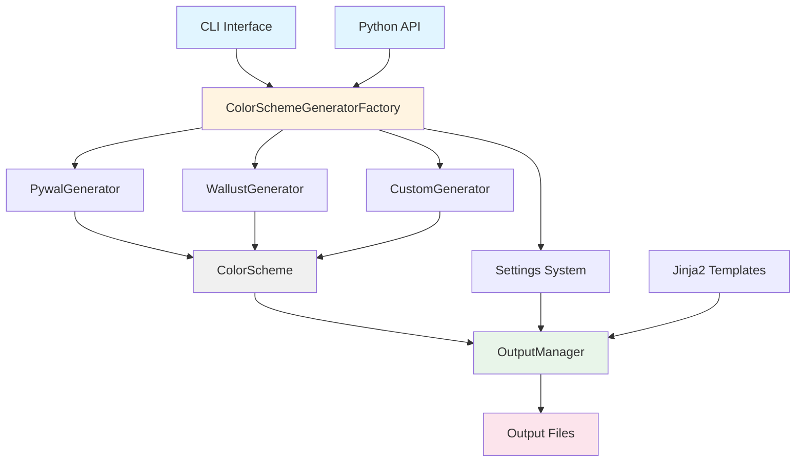
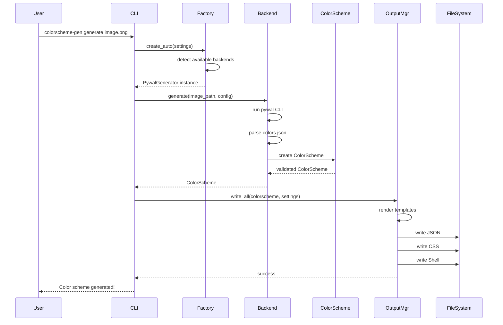
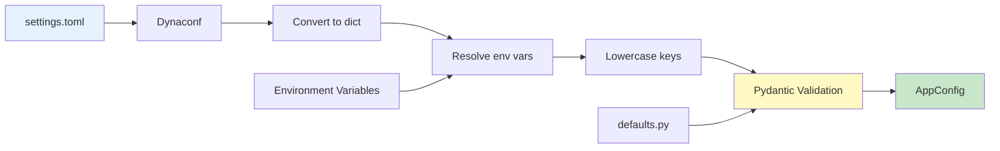
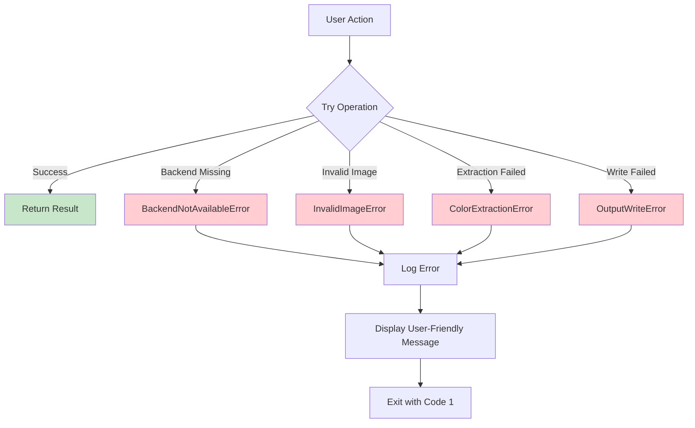

# Architecture Documentation

This document provides a comprehensive overview of the colorscheme-generator architecture, design patterns, and component interactions.

---

## Table of Contents

- [System Overview](#system-overview)
- [Component Architecture](#component-architecture)
- [Data Flow](#data-flow)
- [Design Patterns](#design-patterns)
- [Module Descriptions](#module-descriptions)
- [Extension Points](#extension-points)

---

## System Overview

The colorscheme-generator follows a **layered architecture** with clear separation of concerns:

```
┌─────────────────────────────────────────────────────────────────┐
│                    Presentation Layer                            │
│  - CLI (argparse)                                                │
│  - Python API                                                    │
└────────────────────────────────┬────────────────────────────────┘
                                 │
┌────────────────────────────────┴────────────────────────────────┐
│                    Application Layer                             │
│  - Factory (backend selection)                                   │
│  - OutputManager (file generation)                               │
│  - Configuration (Dynaconf + Pydantic)                           │
└────────────────────────────────┬────────────────────────────────┘
                                 │
┌────────────────────────────────┴────────────────────────────────┐
│                    Domain Layer                                  │
│  - ColorScheme (domain model)                                    │
│  - Color (value object)                                          │
│  - GeneratorConfig (configuration object)                        │
└────────────────────────────────┬────────────────────────────────┘
                                 │
┌────────────────────────────────┴────────────────────────────────┐
│                    Infrastructure Layer                          │
│  - Backends (pywal, wallust, custom)                             │
│  - Template Engine (Jinja2)                                      │
│  - File System                                                   │
└─────────────────────────────────────────────────────────────────┘
```

### Design Principles

1. **Separation of Concerns**: Each layer has a single responsibility
2. **Dependency Inversion**: High-level modules don't depend on low-level modules
3. **Open/Closed**: Open for extension (new backends), closed for modification
4. **Interface Segregation**: Small, focused interfaces (ColorSchemeGenerator)
5. **Single Responsibility**: Each class has one reason to change

---

## Component Architecture

### High-Level Component Diagram



### Component Responsibilities

| Component | Responsibility | Dependencies |
|-----------|----------------|--------------|
| **CLI** | Parse arguments, invoke factory | Factory, Settings |
| **Factory** | Create backend instances, auto-detection | Backends, Settings |
| **Backends** | Extract colors from images | External tools, PIL |
| **ColorScheme** | Domain model for color data | Color (value object) |
| **OutputManager** | Generate output files from templates | Jinja2, ColorScheme |
| **Settings** | Load and validate configuration | Dynaconf, Pydantic |

---

## Data Flow

### Color Extraction Flow



### Settings Loading Flow



---

## Design Patterns

### 1. Factory Pattern

**Purpose**: Create backend instances without exposing instantiation logic.

**Implementation**: `ColorSchemeGeneratorFactory`

```python
class ColorSchemeGeneratorFactory:
    @staticmethod
    def create(backend: Backend, settings: AppConfig) -> ColorSchemeGenerator:
        """Create specific backend instance."""
        if backend == Backend.PYWAL:
            return PywalGenerator(settings)
        elif backend == Backend.WALLUST:
            return WallustGenerator(settings)
        elif backend == Backend.CUSTOM:
            return CustomGenerator(settings)

    @staticmethod
    def create_auto(settings: AppConfig) -> ColorSchemeGenerator:
        """Auto-detect and create available backend."""
        for backend_class in [PywalGenerator, WallustGenerator, CustomGenerator]:
            instance = backend_class(settings)
            if instance.is_available():
                return instance
        raise BackendNotAvailableError("No backends available")
```

**Benefits**:
- Decouples client code from concrete backend classes
- Enables auto-detection logic
- Easy to add new backends

### 2. Strategy Pattern

**Purpose**: Define a family of algorithms (backends), encapsulate each one, and make them interchangeable.

**Implementation**: `ColorSchemeGenerator` abstract base class

```python
class ColorSchemeGenerator(ABC):
    @abstractmethod
    def generate(self, image_path: Path, config: GeneratorConfig) -> ColorScheme:
        """Extract colors from image."""
        pass

    @abstractmethod
    def is_available(self) -> bool:
        """Check if backend is available."""
        pass
```

**Concrete Strategies**:
- `PywalGenerator`: Uses pywal CLI
- `WallustGenerator`: Uses wallust CLI
- `CustomGenerator`: Uses PIL + scikit-learn

**Benefits**:
- Backends are interchangeable at runtime
- Easy to test each backend independently
- New backends don't affect existing code

### 3. Template Method Pattern

**Purpose**: Define skeleton of algorithm, let subclasses override specific steps.

**Implementation**: Backend base class structure

```python
class ColorSchemeGenerator(ABC):
    def generate(self, image_path: Path, config: GeneratorConfig) -> ColorScheme:
        # Template method
        self.ensure_available()  # Step 1
        self._validate_image(image_path)  # Step 2
        colors = self._extract_colors(image_path, config)  # Step 3 (abstract)
        return self._create_colorscheme(colors, image_path)  # Step 4

    @abstractmethod
    def _extract_colors(self, image_path: Path, config: GeneratorConfig):
        """Subclasses implement this."""
        pass
```

### 4. Value Object Pattern

**Purpose**: Immutable objects representing values (no identity).

**Implementation**: `Color` class

```python
@dataclass(frozen=True)
class Color:
    hex: str
    rgb: tuple[int, int, int]
    hsl: tuple[float, float, float] | None = None

    def adjust_saturation(self, factor: float) -> "Color":
        """Returns new Color (immutable)."""
        # ... implementation
        return Color(hex=new_hex, rgb=new_rgb, hsl=new_hsl)
```

**Benefits**:
- Thread-safe (immutable)
- Can be used as dict keys
- Clear value semantics

### 5. Dependency Injection

**Purpose**: Inject dependencies rather than creating them internally.

**Implementation**: Settings injection into backends

```python
class PywalGenerator:
    def __init__(self, settings: AppConfig):
        self.settings = settings  # Injected dependency
        self.cache_dir = Path.home() / ".cache" / "wal"
```

**Benefits**:
- Easier testing (mock settings)
- Loose coupling
- Configuration flexibility

---

## Module Descriptions

### `colorscheme_generator.backends`

**Purpose**: Color extraction implementations.

**Modules**:
- `pywal.py`: Pywal backend (external CLI)
- `wallust.py`: Wallust backend (external CLI)
- `custom.py`: Custom backend (PIL + scikit-learn)

**Key Classes**:
```
ColorSchemeGenerator (ABC)
├── PywalGenerator
├── WallustGenerator
└── CustomGenerator
```

**Responsibilities**:
- Validate image files
- Run color extraction
- Parse results into ColorScheme
- Apply saturation adjustment

### `colorscheme_generator.config`

**Purpose**: Configuration management.

**Modules**:
- `settings.toml`: Default configuration file
- `settings.py`: Dynaconf loader
- `config.py`: Pydantic models
- `defaults.py`: Default values
- `enums.py`: Enumerations (Backend, ColorFormat, etc.)

**Key Classes**:
```
AppConfig
├── OutputSettings
├── GenerationSettings
├── BackendSettings
│   ├── PywalBackendSettings
│   ├── WallustBackendSettings
│   └── CustomBackendSettings
└── TemplateSettings
```

**Responsibilities**:
- Load settings from TOML
- Validate with Pydantic
- Provide type-safe access
- Resolve environment variables

### `colorscheme_generator.core`

**Purpose**: Core domain models and managers.

**Modules**:
- `types.py`: Domain models (ColorScheme, Color, GeneratorConfig)
- `base.py`: Abstract base classes
- `exceptions.py`: Custom exceptions
- `managers/output_manager.py`: Output file generation

**Key Classes**:
```
ColorScheme (domain model)
Color (value object)
GeneratorConfig (configuration object)
OutputManager (service)
```

**Responsibilities**:
- Define domain model
- Validate color data
- Manage output file generation
- Render Jinja2 templates

### `colorscheme_generator.templates`

**Purpose**: Jinja2 templates for output formats.

**Files**:
- `colors.json.j2`: JSON format
- `colors.sh.j2`: Shell script
- `colors.css.j2`: CSS variables
- `colors.yaml.j2`: YAML format
- `colors.gtk.css.j2`: GTK theme
- `colors.sequences.j2`: Terminal sequences
- `colors.rasi.j2`: Rofi theme

**Template Variables**:
```jinja2
{{ background.hex }}        # Background color hex
{{ foreground.rgb }}        # Foreground RGB tuple
{{ colors[0].hex }}         # First color hex
{{ metadata.source_image }} # Source image path
{{ metadata.backend }}      # Backend name
```

### `colorscheme_generator.cli`

**Purpose**: Command-line interface.

**Functions**:
- `main()`: Entry point, argument parsing
- `cmd_generate()`: Generate command handler
- `cmd_show()`: Show command handler

**Responsibilities**:
- Parse CLI arguments
- Load settings
- Invoke factory
- Display results

### `colorscheme_generator.factory`

**Purpose**: Backend instantiation and auto-detection.

**Class**: `ColorSchemeGeneratorFactory`

**Methods**:
- `create()`: Create specific backend
- `create_auto()`: Auto-detect backend
- `list_available()`: List available backends

---

## Extension Points

### Adding a New Backend

1. **Create backend class** in `backends/`:
```python
class MyBackend(ColorSchemeGenerator):
    def __init__(self, settings: AppConfig):
        self.settings = settings

    def is_available(self) -> bool:
        return shutil.which("my-tool") is not None

    def generate(self, image_path: Path, config: GeneratorConfig) -> ColorScheme:
        # Implementation
        pass
```

2. **Add to factory** in `factory.py`:
```python
def create(backend: Backend, settings: AppConfig):
    if backend == Backend.MY_BACKEND:
        return MyBackend(settings)
```

3. **Add enum** in `config/enums.py`:
```python
class Backend(str, Enum):
    MY_BACKEND = "my_backend"
```

4. **Add settings** in `config/config.py`:
```python
class MyBackendSettings(BaseModel):
    option1: str = "default"
```

### Adding a New Output Format

1. **Create template** in `templates/`:
```jinja2
{# colors.myformat.j2 #}
# My Format
background: {{ background.hex }}
foreground: {{ foreground.hex }}

color{{ loop.index0 }}: {{ color.hex }}

```

2. **Add to default formats** in `config/defaults.py`:
```python
default_formats = ["json", "sh", "css", "myformat"]
```

3. **Update OutputManager** (if special handling needed):
```python
def _get_template_name(self, format_name: str) -> str:
    if format_name == "myformat":
        return "colors.myformat.j2"
```

---

## Error Handling Strategy

### Exception Hierarchy

```
Exception
└── ColorSchemeGeneratorError (base)
    ├── BackendNotAvailableError
    ├── InvalidImageError
    ├── ColorExtractionError
    └── OutputWriteError
```

### Error Handling Flow



---

## Performance Considerations

### Backend Performance

| Backend | Typical Time | Memory Usage | Notes |
|---------|--------------|--------------|-------|
| pywal | 1-3s | ~50MB | Python overhead |
| wallust | 0.5-1s | ~20MB | Rust, very fast |
| custom | 1-2s | ~100MB | PIL + scikit-learn |

### Optimization Strategies

1. **Lazy Loading**: Backends only loaded when needed
2. **Caching**: Pywal/wallust cache results
3. **Parallel Processing**: Could parallelize multiple images (future)
4. **Template Caching**: Jinja2 templates compiled once

---

## Security Considerations

### Input Validation

- **Image Paths**: Validated to exist and be files
- **Settings**: Validated by Pydantic
- **CLI Arguments**: Validated by argparse

### External Command Execution

- **Subprocess Safety**: Use `subprocess.run()` with `check=True`
- **Path Sanitization**: Resolve and validate paths before passing to CLI
- **No Shell Injection**: Commands built as lists, not strings

### File System Access

- **Output Directory**: Created with safe permissions (0o755)
- **Template Directory**: Validated to exist if custom
- **No Arbitrary Writes**: Output limited to configured directory

---

## Testing Strategy

### Test Pyramid

```
        ┌─────────────┐
        │   E2E Tests │  (Few)
        │  CLI + Real │
        │   Backends  │
        └─────────────┘
       ┌───────────────┐
       │ Integration   │  (Some)
       │ Tests         │
       │ Backend +     │
       │ OutputManager │
       └───────────────┘
      ┌─────────────────┐
      │   Unit Tests    │  (Many)
      │  Individual     │
      │  Components     │
      └─────────────────┘
```

### Test Coverage

- **Unit Tests**: 80%+ coverage
- **Integration Tests**: Key workflows
- **E2E Tests**: CLI commands with real backends

See **[Development Guide](development.md)** for testing details.


