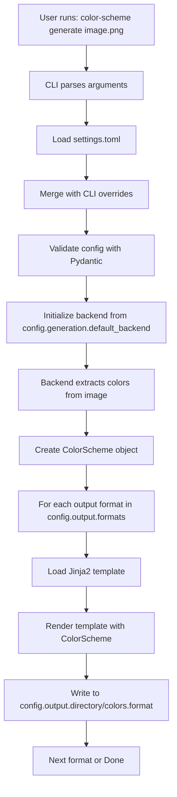

# Architecture Overview

This document provides a high-level overview of the color-scheme architecture, explaining the monorepo structure, package design, and core components.

## Table of Contents

- [System Architecture](#system-architecture)
- [Monorepo Structure](#monorepo-structure)
- [Package Descriptions](#package-descriptions)
- [Component Architecture](#component-architecture)
- [Technology Stack](#technology-stack)
- [Design Principles](#design-principles)

## System Architecture

color-scheme is a CLI tool for extracting color palettes from images and generating color schemes in multiple formats. The system is designed as a monorepo with two independent but related packages:

```
┌─────────────────────────────────────────────────────────────┐
│                        User Interface                        │
│                   (color-scheme CLI)                         │
└─────────────────┬───────────────────────┬───────────────────┘
                  │                       │
        ┌─────────▼─────────┐   ┌────────▼─────────┐
        │  Core Package     │   │  Orchestrator    │
        │  (Host-based)     │   │  (Container)     │
        └─────────┬─────────┘   └────────┬─────────┘
                  │                      │
          ┌───────┴────────┐      ┌──────▼──────┐
          │   Backends:    │      │  Container  │
          │  • pywal       │      │  Runtime    │
          │  • wallust     │      │  (Docker/   │
          │  • custom      │      │   Podman)   │
          └───────┬────────┘      └──────┬──────┘
                  │                      │
          ┌───────▼────────┐      ┌──────▼──────┐
          │   Template     │      │  Core in    │
          │   Engine       │      │  Container  │
          │  (Jinja2)      │      └─────────────┘
          └───────┬────────┘
                  │
          ┌───────▼────────┐
          │  Output Files  │
          │  (JSON, CSS,   │
          │   SCSS, etc.)  │
          └────────────────┘
```

## Monorepo Structure

The project uses a monorepo structure with two independent packages:

```
color-scheme/
├── packages/
│   ├── core/                    # Standalone color extraction
│   │   ├── src/
│   │   │   └── color_scheme/
│   │   │       ├── cli/         # CLI commands
│   │   │       ├── config/      # Configuration system
│   │   │       ├── backends/    # Color extraction backends (Phase 2)
│   │   │       ├── templates/   # Jinja2 templates
│   │   │       └── generators/  # Output generators (Phase 3)
│   │   ├── tests/
│   │   │   ├── unit/           # Unit tests
│   │   │   ├── integration/    # Integration tests
│   │   │   └── fixtures/       # Test fixtures
│   │   └── pyproject.toml
│   │
│   └── orchestrator/            # Container orchestration
│       ├── src/
│       │   └── color_scheme_orchestrator/
│       │       ├── cli/         # CLI delegation
│       │       └── container/   # Container management (Phase 4)
│       ├── tests/
│       └── pyproject.toml
│
├── templates/                   # Shared templates
├── scripts/                     # Development scripts
├── docs/                        # Documentation
└── .github/                     # CI/CD workflows
```

### Why Monorepo?

1. **Shared Development**: Both packages share development tooling, scripts, and CI
2. **Coordinated Releases**: Changes can be tested and released together
3. **Code Sharing**: Templates and utilities can be shared
4. **Single Source of Truth**: One repository for all project code
5. **Simplified CI**: Single CI pipeline with package-specific jobs

## Package Descriptions

### Core Package (color-scheme-core)

**Purpose**: Standalone color extraction and scheme generation

**Key Features**:
- Direct installation on host system
- Multiple backend support (pywal, wallust, custom)
- Configuration via settings.toml
- Template-based output generation
- Full CLI interface

**Use Cases**:
- Users who want direct control
- Environments without Docker/Podman
- Development and debugging
- Custom backend development

**Dependencies**:
- Python 3.12+
- Backend tools (pywal, wallust) installed separately
- Python libraries: Pydantic, Jinja2, dynaconf, Pillow, numpy, scikit-learn

### Orchestrator Package (color-scheme-orchestrator)

**Purpose**: Containerized execution layer

**Key Features**:
- Runs core in isolated containers
- No backend installation required
- Same CLI as core package
- Automatic container management
- Docker/Podman support

**Use Cases**:
- Users who prefer isolation
- Systems with container runtime
- Automated environments (CI/CD)
- Multiple backend versions

**Dependencies**:
- Python 3.12+
- Docker or Podman
- color-scheme-core (bundled in container)

### Package Relationship

The packages are **independent but compatible**:

- Both expose `color-scheme` CLI
- Install one, not both (typically)
- Core is a dependency of orchestrator (embedded in containers)
- Same command-line interface
- Different execution environments

## Component Architecture

### Configuration System

The configuration system uses dynaconf + Pydantic for type-safe settings:

```
┌──────────────────────────────────────────────────────┐
│  settings.toml (TOML file)                           │
└────────────────┬─────────────────────────────────────┘
                 │
                 ▼
┌──────────────────────────────────────────────────────┐
│  dynaconf (File loading, env var resolution)         │
└────────────────┬─────────────────────────────────────┘
                 │
                 ▼
┌──────────────────────────────────────────────────────┐
│  Pydantic Models (Type validation, defaults)         │
│  • LoggingSettings                                   │
│  • OutputSettings                                    │
│  • GenerationSettings                                │
│  • BackendSettings                                   │
│  • TemplateSettings                                  │
└────────────────┬─────────────────────────────────────┘
                 │
                 ▼
┌──────────────────────────────────────────────────────┐
│  AppConfig (Validated configuration object)          │
└──────────────────────────────────────────────────────┘
```

**Key Files**:
- `config/settings.toml` - Default settings
- `config/config.py` - Pydantic models
- `config/settings.py` - Settings loader
- `config/enums.py` - Enumerations
- `config/defaults.py` - Default values

### CLI Architecture (Typer-based)

```
┌──────────────────────────────────────────────────────┐
│  color-scheme (Entry point)                          │
└────────────────┬─────────────────────────────────────┘
                 │
                 ▼
┌──────────────────────────────────────────────────────┐
│  cli/main.py (Typer app, command registration)      │
└────────────────┬─────────────────────────────────────┘
                 │
          ┌──────┴──────┐
          ▼             ▼
┌──────────────┐ ┌──────────────┐
│  Commands:   │ │  Shared:     │
│  • generate  │ │  • Config    │
│  • show      │ │  • Logger    │
│  • install   │ │  • Options   │
│  • version   │ │              │
└──────────────┘ └──────────────┘
```

### Backend System (Phase 2)

Each backend implements a common interface:

```python
class BackendInterface:
    def extract_colors(self, image_path: Path) -> ColorScheme:
        """Extract colors from image."""
        pass
```

**Backends**:
1. **Pywal Backend**: Delegates to pywal command
2. **Wallust Backend**: Delegates to wallust command
3. **Custom Backend**: Pure Python using scikit-learn k-means

### Template System

Uses Jinja2 for flexible output generation:

```
┌──────────────────────────────────────────────────────┐
│  ColorScheme (extracted colors)                      │
└────────────────┬─────────────────────────────────────┘
                 │
                 ▼
┌──────────────────────────────────────────────────────┐
│  Template Engine (Jinja2)                            │
│  • Template directory: templates/                    │
│  • Variables: colors, source_image, backend, etc.    │
└────────────────┬─────────────────────────────────────┘
                 │
          ┌──────┴──────┬──────────┬──────────┐
          ▼             ▼          ▼          ▼
    ┌─────────┐  ┌─────────┐  ┌────────┐  ┌────────┐
    │ JSON    │  │ CSS     │  │ SCSS   │  │ YAML   │
    └─────────┘  └─────────┘  └────────┘  └────────┘
```

**Template Files**:
- `colors.json.j2` - JSON format
- `colors.css.j2` - CSS variables
- `colors.scss.j2` - SCSS variables
- `colors.yaml.j2` - YAML format
- `colors.sh.j2` - Shell script
- `colors.gtk.css.j2` - GTK CSS
- `colors.rasi.j2` - rofi configuration
- `colors.sequences.j2` - Terminal escape sequences

## Technology Stack

### Core Technologies

**Language & Runtime**:
- Python 3.12+ (required for modern type hints)
- uv (package management and virtual environments)

**CLI Framework**:
- Typer - Type-safe CLI with automatic help generation
- Rich - Terminal formatting and output

**Configuration**:
- dynaconf - TOML file loading and environment variable resolution
- Pydantic - Type validation and data modeling

**Color Processing**:
- Pillow (PIL) - Image loading and manipulation
- numpy - Array operations
- scikit-learn - k-means clustering for custom backend

**Templates**:
- Jinja2 - Template engine for output generation

### Development Tools

**Testing**:
- pytest - Test framework
- pytest-cov - Coverage reporting
- pytest-xdist - Parallel test execution

**Code Quality**:
- black - Code formatting
- isort - Import sorting
- ruff - Fast Python linter
- mypy - Static type checking
- bandit - Security scanning

**CI/CD**:
- GitHub Actions - Automated testing and deployment
- codecov - Coverage reporting

**Containers** (Orchestrator):
- Docker or Podman - Container runtime

### External Dependencies

From GitHub repositories:
- rich-logging - Rich-based logging (custom utility)
- task-pipeline - Task orchestration (custom utility)
- container-manager - Container management (custom utility)

## Design Principles

### 1. YAGNI (You Aren't Gonna Need It)

Only implement features when they're actually needed. Avoid speculative features.

**Example**: Config system only includes settings for Phase 1-3, not theoretical future features.

### 2. Type Safety

Use Pydantic models and type hints throughout for compile-time error detection.

**Example**: All configuration validated with Pydantic before use.

### 3. Separation of Concerns

Clear boundaries between components:
- Configuration (config/)
- CLI (cli/)
- Backends (backends/)
- Templates (templates/)
- Output generation (generators/)

### 4. Testability

All components designed for easy testing:
- Dependency injection
- Interface-based design
- Mockable external dependencies
- 95%+ test coverage requirement

### 5. Configuration over Code

Prefer configuration files over hard-coded values:
- settings.toml for defaults
- CLI flags for overrides
- Environment variables for deployment

### 6. Template-Driven Output

Use Jinja2 templates for all output formats:
- Easy to add new formats
- User-customizable
- Separation of logic and presentation

### 7. Backward Compatibility

Once features are released:
- Maintain CLI interface
- Support old config formats
- Use deprecation warnings

## Data Flow

### Typical Execution Flow (Core)



### Configuration Priority

Settings are resolved in this order (highest priority first):

1. CLI flags (`--backend pywal`)
2. Environment variables (`COLOR_SCHEME_BACKEND=pywal`)
3. User settings (`~/.config/color-scheme/settings.toml`)
4. Package settings (`config/settings.toml`)
5. Pydantic defaults

## Performance Considerations

### Color Extraction

- **Pywal**: Fast (delegates to optimized C/Rust)
- **Wallust**: Fast (Rust-based)
- **Custom**: Slower (Python, but uses numpy/scikit-learn)

### Template Rendering

- Templates cached by Jinja2
- Minimal overhead (<10ms per format)

### File I/O

- All file operations use pathlib
- Atomic writes for output files
- Minimal memory footprint (colors only, not full image)

## Security Considerations

1. **Input Validation**: All user input validated with Pydantic
2. **Path Traversal**: Paths resolved and validated
3. **Command Injection**: Backend commands use argument lists, not shell
4. **Container Isolation**: Orchestrator runs backends in containers
5. **Dependency Scanning**: Automated with bandit and pip-audit

## Future Architecture

### Phase 2: Backends

Add backend implementations to core:
- `backends/pywal.py`
- `backends/wallust.py`
- `backends/custom.py`
- `backends/base.py` (interface)

### Phase 3: Output Generation

Add output generators:
- `generators/base.py` (interface)
- `generators/template_generator.py` (Jinja2-based)

### Phase 4: Orchestrator

Add container orchestration:
- `orchestrator/container/manager.py`
- `orchestrator/container/images.py`
- Dockerfile for each backend

### Phase 5: Advanced Features

- Color scheme editing
- Palette preview (terminal/GUI)
- Favorite schemes
- Remote backends (API)

## Related Documentation

- [Monorepo Architecture Design](../plans/2026-01-18-monorepo-architecture-design.md) - Detailed design decisions
- [Implementation Progress](../implementation-progress.md) - Current development status
- [Getting Started](../development/getting-started.md) - Developer setup
- [Testing Guide](../development/testing.md) - Testing architecture and patterns
