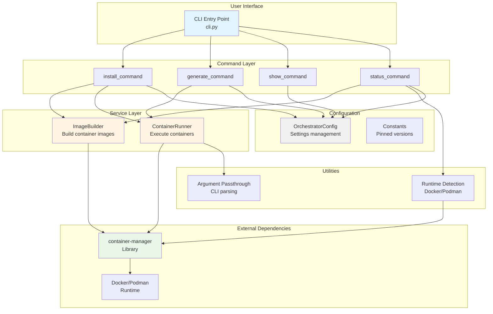
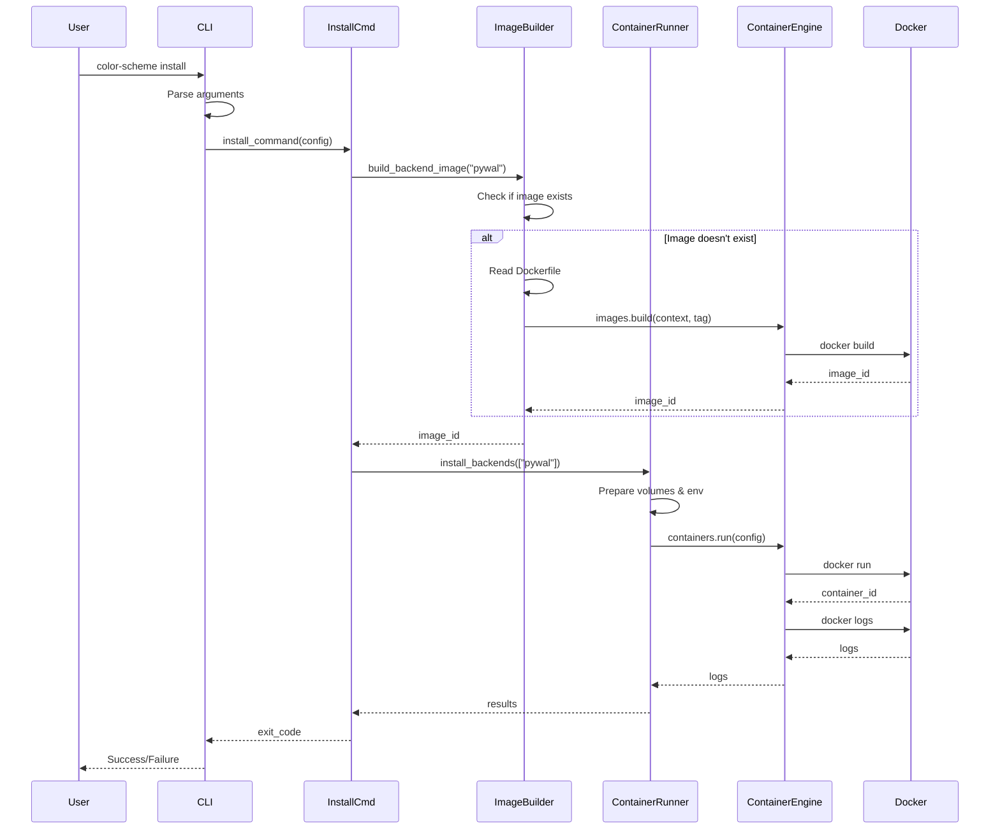
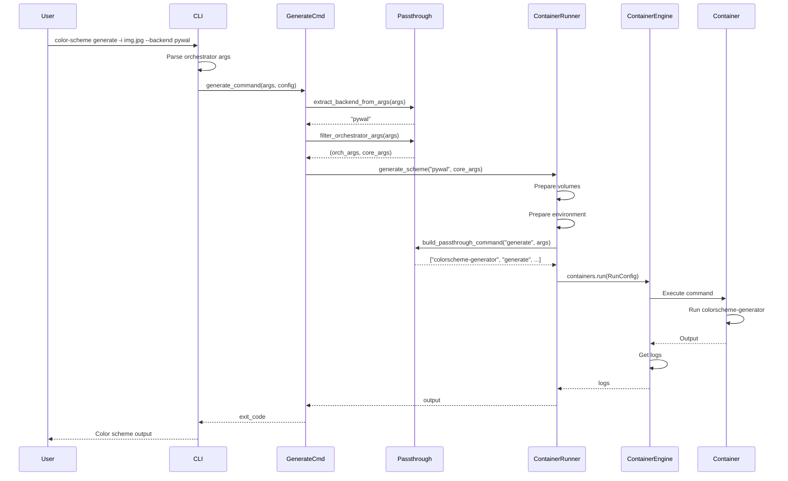

# Architecture Overview

> **Deep dive into the Color Scheme Orchestrator architecture**

## Table of Contents

- [System Architecture](#system-architecture)
- [Component Diagram](#component-diagram)
- [Data Flow](#data-flow)
- [Layer Architecture](#layer-architecture)
- [Design Patterns](#design-patterns)
- [Dependencies](#dependencies)

## System Architecture

The orchestrator follows a **layered architecture** with clear separation of concerns:

```
┌─────────────────────────────────────────────────────────────┐
│                     PRESENTATION LAYER                       │
│                                                              │
│  ┌────────────────────────────────────────────────────┐    │
│  │  CLI Interface (cli.py)                            │    │
│  │  - Argument parsing                                │    │
│  │  - Command routing                                 │    │
│  │  - Logging setup                                   │    │
│  └────────────────────────────────────────────────────┘    │
└──────────────────────────┬───────────────────────────────────┘
                           │
┌──────────────────────────┴───────────────────────────────────┐
│                     APPLICATION LAYER                        │
│                                                              │
│  ┌────────────────┐  ┌────────────────┐  ┌──────────────┐  │
│  │ install_command│  │generate_command│  │show_command  │  │
│  └────────────────┘  └────────────────┘  └──────────────┘  │
│  ┌────────────────┐                                         │
│  │ status_command │                                         │
│  └────────────────┘                                         │
└──────────────────────────┬───────────────────────────────────┘
                           │
┌──────────────────────────┴───────────────────────────────────┐
│                      SERVICE LAYER                           │
│                                                              │
│  ┌────────────────────────┐  ┌──────────────────────────┐  │
│  │  ImageBuilder          │  │  ContainerRunner         │  │
│  │  - build_backend_image │  │  - run_backend           │  │
│  │  - build_custom_image  │  │  - install_backends      │  │
│  │  - remove_image        │  │  - generate_scheme       │  │
│  │  - list_built_images   │  │  - cleanup_container     │  │
│  └────────────────────────┘  └──────────────────────────┘  │
└──────────────────────────┬───────────────────────────────────┘
                           │
┌──────────────────────────┴───────────────────────────────────┐
│                    INFRASTRUCTURE LAYER                      │
│                                                              │
│  ┌────────────────────────────────────────────────────┐    │
│  │  Configuration (config/)                           │    │
│  │  - OrchestratorConfig                              │    │
│  │  - Constants & defaults                            │    │
│  └────────────────────────────────────────────────────┘    │
│                                                              │
│  ┌────────────────────────────────────────────────────┐    │
│  │  Utilities (utils/)                                │    │
│  │  - Runtime detection                               │    │
│  │  - Argument passthrough                            │    │
│  └────────────────────────────────────────────────────┘    │
│                                                              │
│  ┌────────────────────────────────────────────────────┐    │
│  │  Container Manager Library (external)              │    │
│  │  - ContainerEngine abstraction                     │    │
│  │  - Docker/Podman implementations                   │    │
│  └────────────────────────────────────────────────────┘    │
└──────────────────────────────────────────────────────────────┘
```

## Component Diagram



## Data Flow

### Installation Flow



### Generation Flow



## Layer Architecture

### 1. Presentation Layer

**Responsibility**: User interaction and input validation

**Components**:
- `cli.py`: Argument parsing, command routing, logging setup

**Key Functions**:
```python
def main(argv: Optional[list[str]] = None) -> int
def create_parser() -> ArgumentParser
def setup_logging(verbose: bool, debug: bool) -> None
```

### 2. Application Layer

**Responsibility**: Business logic and workflow orchestration

**Components**:
- `commands/install.py`: Backend installation workflow
- `commands/generate.py`: Color scheme generation workflow
- `commands/show.py`: Information display
- `commands/status.py`: System status checking

**Key Functions**:
```python
def install_command(backends, config, force_rebuild) -> int
def generate_command(args, config) -> int
def show_command(resource, config) -> int
def status_command(config) -> int
```

### 3. Service Layer

**Responsibility**: Core business operations

**Components**:
- `services/image_builder.py`: Container image management
- `services/container_runner.py`: Container execution

**ImageBuilder API**:
```python
class ImageBuilder:
    def build_backend_image(backend: str, force_rebuild: bool) -> str
    def build_custom_backend_image(script: str, name: str) -> str
    def remove_image(image_name: str) -> None
    def list_built_images() -> list[str]
```

**ContainerRunner API**:
```python
class ContainerRunner:
    def run_backend(backend: str, command: str, args: list[str]) -> str
    def install_backends(backends: list[str]) -> dict[str, str]
    def generate_scheme(backend: str, args: list[str]) -> str
    def cleanup_container(container_name: str) -> None
```

### 4. Infrastructure Layer

**Responsibility**: Configuration, utilities, and external integrations

**Components**:
- `config/config.py`: Configuration management
- `config/constants.py`: Pinned versions and defaults
- `utils/runtime.py`: Container runtime detection
- `utils/passthrough.py`: Argument handling

## Design Patterns

### 1. Factory Pattern

**Used in**: Runtime detection and engine creation

```python
# ContainerEngineFactory creates appropriate engine
engine = ContainerEngineFactory.create(ContainerRuntime.DOCKER)
```

### 2. Strategy Pattern

**Used in**: Backend selection and execution

```python
# Different backends (pywal, wallust, custom) implement same interface
runner.run_backend(backend="pywal", command="generate", args=args)
runner.run_backend(backend="wallust", command="generate", args=args)
```

### 3. Builder Pattern

**Used in**: Container configuration

```python
# RunConfig builds complex container configuration
config = RunConfig(
    image=image_name,
    command=cmd,
    volumes=volumes,
    environment=env,
    user=user_id,
)
```

### 4. Facade Pattern

**Used in**: Simplifying container-manager library

```python
# ContainerRunner provides simple interface to complex operations
runner = ContainerRunner(engine, config)
output = runner.generate_scheme(backend, args)
```

## Dependencies

### Internal Dependencies

```
orchestrator/
├── container-manager (sibling package)
│   └── Provides: ContainerEngine, RunConfig, BuildContext
└── colorscheme-generator (core tool)
    └── Runs inside containers
```

### External Dependencies

```python
# From pyproject.toml
dependencies = [
    "container-manager",  # Container abstraction
]

# Python standard library
- argparse: CLI parsing
- logging: Logging infrastructure
- pathlib: Path manipulation
- dataclasses: Configuration objects
- uuid: Unique container names
```

### Runtime Dependencies

- **Docker** (≥20.10) OR **Podman** (≥3.0)
- **Python** (≥3.12)

## Module Dependency Graph

```
cli.py
  ├─→ commands/
  │     ├─→ install.py
  │     │     ├─→ services/image_builder.py
  │     │     ├─→ services/container_runner.py
  │     │     └─→ config/config.py
  │     ├─→ generate.py
  │     │     ├─→ services/container_runner.py
  │     │     ├─→ utils/passthrough.py
  │     │     └─→ config/config.py
  │     ├─→ show.py
  │     │     └─→ config/config.py
  │     └─→ status.py
  │           ├─→ services/image_builder.py
  │           ├─→ utils/runtime.py
  │           └─→ config/config.py
  ├─→ config/
  │     ├─→ config.py
  │     └─→ constants.py
  └─→ utils/
        ├─→ runtime.py
        │     └─→ container_manager
        └─→ passthrough.py

services/
  ├─→ image_builder.py
  │     ├─→ container_manager
  │     └─→ utils/passthrough.py
  └─→ container_runner.py
        ├─→ container_manager
        ├─→ config/config.py
        └─→ utils/passthrough.py
```

## Key Architectural Decisions

### 1. Layered Architecture

**Decision**: Use strict layering with unidirectional dependencies

**Rationale**:
- Clear separation of concerns
- Easy to test individual layers
- Maintainable and extensible

### 2. Container Abstraction

**Decision**: Use container-manager library instead of direct Docker/Podman calls

**Rationale**:
- Runtime-agnostic implementation
- Consistent API across Docker and Podman
- Easier to test with mocks

### 3. Argument Passthrough

**Decision**: Pass unrecognized arguments directly to core tool

**Rationale**:
- Transparent to users
- No need to mirror core tool's CLI
- Automatically supports new core tool features

### 4. Configuration Precedence

**Decision**: Environment variables > CLI args > Config files > Defaults

**Rationale**:
- Standard Unix convention
- Flexible for different use cases
- Easy to override in CI/CD

### 5. Stateless Containers

**Decision**: Containers are ephemeral and removed after execution

**Rationale**:
- No state accumulation
- Clean execution environment
- Easier debugging

---

**Next**: [Container Lifecycle](container-lifecycle.md) | [CLI Reference](cli-reference.md)

