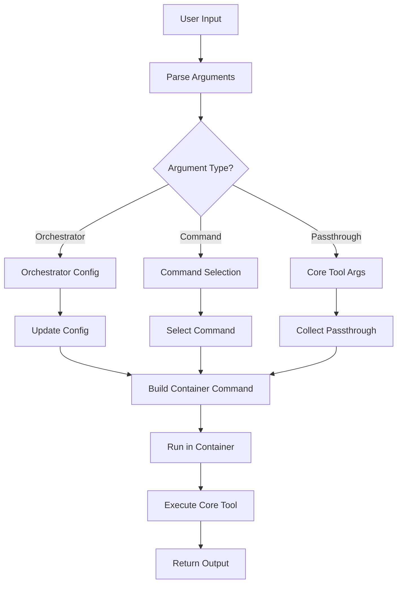

# Argument Passthrough

> **How arguments flow from CLI to backend containers**

## Table of Contents

- [Overview](#overview)
- [Argument Types](#argument-types)
- [Parsing Flow](#parsing-flow)
- [Filtering Logic](#filtering-logic)
- [Examples](#examples)

## Overview

The orchestrator acts as a transparent proxy between the user and the core tool running in containers. It intercepts orchestrator-specific arguments while passing all other arguments directly to the core tool.

### Design Goals

```
┌─────────────────────────────────────────────────────────────┐
│ Transparency                                                │
│ └─ User shouldn't need to know about containers             │
└─────────────────────────────────────────────────────────────┘

┌─────────────────────────────────────────────────────────────┐
│ Flexibility                                                 │
│ └─ Support all core tool arguments without modification     │
└─────────────────────────────────────────────────────────────┘

┌─────────────────────────────────────────────────────────────┐
│ Control                                                     │
│ └─ Orchestrator can control container behavior              │
└─────────────────────────────────────────────────────────────┘
```

## Argument Types

### Orchestrator Arguments

These arguments control the orchestrator's behavior and are **not** passed to the core tool:

```
┌─────────────────────────────────────────────────────────────┐
│ Orchestrator-Only Arguments                                 │
├─────────────────────────────────────────────────────────────┤
│ --runtime RUNTIME       Container runtime to use            │
│ --output-dir DIR        Output directory                    │
│ --config-dir DIR        Configuration directory             │
│ --cache-dir DIR         Cache directory                     │
│ --verbose, -v           Verbose logging                     │
│ --debug, -d             Debug logging                       │
└─────────────────────────────────────────────────────────────┘
```

### Core Tool Arguments

These arguments are passed directly to the core tool running in the container:

```
┌─────────────────────────────────────────────────────────────┐
│ Core Tool Arguments (Passthrough)                           │
├─────────────────────────────────────────────────────────────┤
│ -i, --image PATH        Input image file                    │
│ --backend BACKEND       Backend to use                      │
│ --output-format FORMAT  Output format                       │
│ --saturation FLOAT      Color saturation                    │
│ --help                  Show core tool help                 │
│ ... and all other core tool arguments                       │
└─────────────────────────────────────────────────────────────┘
```

### Command Arguments

Commands determine which operation to perform:

```
┌─────────────────────────────────────────────────────────────┐
│ Commands                                                    │
├─────────────────────────────────────────────────────────────┤
│ install                 Install backends                    │
│ generate                Generate color scheme               │
│ show                    Show information                    │
│ status                  Show system status                  │
└─────────────────────────────────────────────────────────────┘
```

## Parsing Flow

### Complete Argument Flow



### Parsing Steps

```
┌─────────────────────────────────────────────────────────────┐
│ Step 1: Split Arguments                                     │
│    └─ Separate orchestrator args from core args             │
└─────────────────────────────────────────────────────────────┘
                           ↓
┌─────────────────────────────────────────────────────────────┐
│ Step 2: Extract Command                                     │
│    └─ Identify command (install, generate, etc.)            │
└─────────────────────────────────────────────────────────────┘
                           ↓
┌─────────────────────────────────────────────────────────────┐
│ Step 3: Update Configuration                                │
│    └─ Apply orchestrator args to config                     │
└─────────────────────────────────────────────────────────────┘
                           ↓
┌─────────────────────────────────────────────────────────────┐
│ Step 4: Build Container Command                             │
│    └─ Construct command for core tool                       │
└─────────────────────────────────────────────────────────────┘
                           ↓
┌─────────────────────────────────────────────────────────────┐
│ Step 5: Execute in Container                                │
│    └─ Run core tool with passthrough args                   │
└─────────────────────────────────────────────────────────────┘
```

## Filtering Logic

### filter_orchestrator_args()

This function separates orchestrator arguments from core tool arguments:

```python
def filter_orchestrator_args(
    args: list[str],
) -> tuple[dict[str, Any], list[str]]:
    """
    Filter out orchestrator-specific arguments.
    
    Args:
        args: All arguments provided
    
    Returns:
        Tuple of (orchestrator_args, core_passthrough_args)
    """
    orchestrator_args: dict[str, Any] = {}
    core_args: list[str] = []
    
    i = 0
    while i < len(args):
        arg = args[i]
        
        # Check if orchestrator-specific
        if arg == "--runtime":
            orchestrator_args["runtime"] = args[i + 1]
            i += 2
        elif arg == "--verbose" or arg == "-v":
            orchestrator_args["verbose"] = True
            i += 1
        # ... more orchestrator args
        else:
            # Pass through to core
            core_args.append(arg)
            i += 1
    
    return orchestrator_args, core_args
```

### Filtering Rules

```
┌─────────────────────────────────────────────────────────────┐
│ Rule 1: Exact Match                                         │
│    └─ --runtime, --verbose, --debug                         │
└─────────────────────────────────────────────────────────────┘

┌─────────────────────────────────────────────────────────────┐
│ Rule 2: Short Form                                          │
│    └─ -v (verbose), -d (debug)                              │
└─────────────────────────────────────────────────────────────┘

┌─────────────────────────────────────────────────────────────┐
│ Rule 3: Value Arguments                                     │
│    └─ --runtime docker, --output-dir ~/schemes              │
└─────────────────────────────────────────────────────────────┘

┌─────────────────────────────────────────────────────────────┐
│ Rule 4: Equals Form                                         │
│    └─ --runtime=docker, --output-dir=~/schemes              │
└─────────────────────────────────────────────────────────────┘

┌─────────────────────────────────────────────────────────────┐
│ Rule 5: Everything Else                                     │
│    └─ Pass through to core tool                             │
└─────────────────────────────────────────────────────────────┘
```

### build_passthrough_command()

This function constructs the final command to run in the container:

```python
def build_passthrough_command(
    core_command: str,
    additional_args: list[str],
) -> list[str]:
    """
    Build the complete command for core tool.
    
    Args:
        core_command: The core tool command (e.g., 'generate')
        additional_args: Additional arguments to pass through
    
    Returns:
        Complete command list for container execution
    """
    return ["colorscheme-generator", core_command] + additional_args
```

### Command Construction

```
Input:
  core_command = "generate"
  additional_args = ["-i", "image.jpg", "--backend", "pywal"]

Output:
  ["colorscheme-generator", "generate", "-i", "image.jpg", "--backend", "pywal"]

Container Execution:
  $ colorscheme-generator generate -i image.jpg --backend pywal
```

## Examples

### Example 1: Simple Generation

**User Input**:
```bash
color-scheme generate -i wallpaper.jpg
```

**Parsing**:
```python
{
    "command": "generate",
    "orchestrator_args": {},
    "core_args": ["-i", "wallpaper.jpg"]
}
```

**Container Command**:
```bash
colorscheme-generator generate -i wallpaper.jpg
```

---

### Example 2: With Orchestrator Options

**User Input**:
```bash
color-scheme --runtime docker --verbose generate -i wallpaper.jpg --backend pywal
```

**Parsing**:
```python
{
    "command": "generate",
    "orchestrator_args": {
        "runtime": "docker",
        "verbose": True
    },
    "core_args": ["-i", "wallpaper.jpg", "--backend", "pywal"]
}
```

**Container Command**:
```bash
colorscheme-generator generate -i wallpaper.jpg --backend pywal
```

**Note**: `--runtime` and `--verbose` are handled by orchestrator, not passed to core tool.

---

### Example 3: Complex Arguments

**User Input**:
```bash
color-scheme --runtime podman --output-dir ~/schemes -v generate -i image.jpg --backend pywal --saturation 0.8 --output-format json
```

**Parsing**:
```python
{
    "command": "generate",
    "orchestrator_args": {
        "runtime": "podman",
        "output_dir": "~/schemes",
        "verbose": True
    },
    "core_args": [
        "-i", "image.jpg",
        "--backend", "pywal",
        "--saturation", "0.8",
        "--output-format", "json"
    ]
}
```

**Container Command**:
```bash
colorscheme-generator generate -i image.jpg --backend pywal --saturation 0.8 --output-format json
```

---

### Example 4: Install Command

**User Input**:
```bash
color-scheme --runtime docker install --force-rebuild
```

**Parsing**:
```python
{
    "command": "install",
    "orchestrator_args": {
        "runtime": "docker"
    },
    "core_args": ["--force-rebuild"]
}
```

**Note**: Install is handled by orchestrator, not passed to core tool.

---

### Example 5: Help Request

**User Input**:
```bash
color-scheme generate --help
```

**Parsing**:
```python
{
    "command": "generate",
    "orchestrator_args": {},
    "core_args": ["--help"]
}
```

**Container Command**:
```bash
colorscheme-generator generate --help
```

**Result**: Shows core tool help, not orchestrator help.

## Backend Extraction

### extract_backend_from_args()

This function extracts the backend name from arguments:

```python
def extract_backend_from_args(args: list[str]) -> str | None:
    """
    Extract backend name from arguments if specified.

    Args:
        args: Parsed arguments from the user

    Returns:
        Backend name if specified, None otherwise
    """
    for i, arg in enumerate(args):
        if arg in ("--backend", "-b"):
            if i + 1 < len(args):
                return args[i + 1]
        elif arg.startswith("--backend="):
            return arg.split("=", 1)[1]

    return None
```

### Backend Detection Examples

```python
# Example 1: Space-separated
args = ["generate", "-i", "image.jpg", "--backend", "pywal"]
backend = extract_backend_from_args(args)
# Result: "pywal"

# Example 2: Equals form
args = ["generate", "-i", "image.jpg", "--backend=wallust"]
backend = extract_backend_from_args(args)
# Result: "wallust"

# Example 3: Short form
args = ["generate", "-i", "image.jpg", "-b", "custom"]
backend = extract_backend_from_args(args)
# Result: "custom"

# Example 4: No backend specified
args = ["generate", "-i", "image.jpg"]
backend = extract_backend_from_args(args)
# Result: None (use default)
```

## Argument Validation

### Command Validation

```python
def parse_core_arguments(args: list[str]) -> tuple[str, list[str]]:
    """
    Parse arguments to separate command from flags.

    Args:
        args: Command line arguments

    Returns:
        Tuple of (command, remaining_args)

    Raises:
        ValueError: If no valid command is found
    """
    valid_commands = {"install", "generate", "show", "status"}

    if not args:
        raise ValueError(
            "No command specified. Use 'install' or 'generate'"
        )

    command = args[0] if args[0] in valid_commands else None

    if not command:
        raise ValueError(
            f"Invalid command: {args[0]}. "
            f"Must be one of: {', '.join(valid_commands)}"
        )

    return command, args[1:]
```

### Validation Examples

```python
# Valid command
args = ["generate", "-i", "image.jpg"]
command, remaining = parse_core_arguments(args)
# Result: ("generate", ["-i", "image.jpg"])

# Invalid command
args = ["invalid", "-i", "image.jpg"]
command, remaining = parse_core_arguments(args)
# Raises: ValueError("Invalid command: invalid. Must be one of: install, generate, show, status")

# No command
args = []
command, remaining = parse_core_arguments(args)
# Raises: ValueError("No command specified. Use 'install' or 'generate'")
```

## Path Handling

### Volume Mount Preparation

When passing file paths to the container, the orchestrator handles path translation:

```python
# User provides host path
user_input = "-i ~/wallpapers/image.jpg"

# Orchestrator expands path
host_path = Path("~/wallpapers/image.jpg").expanduser()
# Result: /home/user/wallpapers/image.jpg

# Mount parent directory
volume_mount = VolumeMount(
    source=str(host_path.parent),  # /home/user/wallpapers
    target="/input",
    read_only=True,
)

# Translate path for container
container_path = f"/input/{host_path.name}"  # /input/image.jpg

# Pass translated path to core tool
core_args = ["-i", container_path]
```

### Path Translation Flow

```
┌─────────────────────────────────────────────────────────────┐
│ Step 1: User Input                                          │
│    └─ -i ~/wallpapers/image.jpg                             │
└─────────────────────────────────────────────────────────────┘
                           ↓
┌─────────────────────────────────────────────────────────────┐
│ Step 2: Expand Path                                         │
│    └─ /home/user/wallpapers/image.jpg                       │
└─────────────────────────────────────────────────────────────┘
                           ↓
┌─────────────────────────────────────────────────────────────┐
│ Step 3: Mount Parent Directory                              │
│    └─ /home/user/wallpapers → /input                        │
└─────────────────────────────────────────────────────────────┘
                           ↓
┌─────────────────────────────────────────────────────────────┐
│ Step 4: Translate Path                                      │
│    └─ /input/image.jpg                                      │
└─────────────────────────────────────────────────────────────┘
                           ↓
┌─────────────────────────────────────────────────────────────┐
│ Step 5: Pass to Core Tool                                   │
│    └─ colorscheme-generator generate -i /input/image.jpg    │
└─────────────────────────────────────────────────────────────┘
```

## Best Practices

### 1. Keep Orchestrator Args Minimal

```bash
# ✅ Good: Only necessary orchestrator args
color-scheme --runtime docker generate -i image.jpg

# ❌ Bad: Unnecessary orchestrator args
color-scheme --runtime docker --verbose --debug --output-dir /tmp generate -i image.jpg
```

### 2. Use Consistent Argument Format

```bash
# ✅ Good: Consistent format
color-scheme --runtime docker --output-dir ~/schemes generate -i image.jpg

# ❌ Bad: Mixed formats
color-scheme --runtime=docker --output-dir ~/schemes generate -i image.jpg
```

### 3. Group Related Arguments

```bash
# ✅ Good: Orchestrator args first, then command, then core args
color-scheme --runtime docker --verbose generate -i image.jpg --backend pywal

# ❌ Bad: Mixed order
color-scheme generate --runtime docker -i image.jpg --verbose --backend pywal
```

### 4. Use Environment for Persistent Settings

```bash
# ✅ Good: Environment for persistent settings
export COLOR_SCHEME_RUNTIME=docker
export COLOR_SCHEME_OUTPUT_DIR=~/schemes
color-scheme generate -i image.jpg

# ❌ Bad: Repeat args every time
color-scheme --runtime docker --output-dir ~/schemes generate -i image.jpg
```

### 5. Validate Arguments Early

```python
# ✅ Good: Validate before container execution
try:
    command, core_args = parse_core_arguments(args)
    backend = extract_backend_from_args(core_args)
except ValueError as e:
    logger.error(f"Invalid arguments: {e}")
    sys.exit(1)

# ❌ Bad: Let container fail
command, core_args = parse_core_arguments(args)
# Container fails with cryptic error
```

## Debugging Passthrough

### Enable Debug Mode

```bash
# See exactly what's passed to container
color-scheme --debug generate -i image.jpg --backend pywal
```

**Output**:
```
DEBUG: Orchestrator args: {'debug': True}
DEBUG: Core args: ['-i', 'image.jpg', '--backend', 'pywal']
DEBUG: Container command: ['colorscheme-generator', 'generate', '-i', 'image.jpg', '--backend', 'pywal']
INFO: Running pywal backend: colorscheme-generator generate -i image.jpg --backend pywal
```

### Common Issues

#### Issue 1: Argument Not Passed

**Symptom**: Core tool doesn't receive expected argument

**Cause**: Argument filtered as orchestrator arg

**Solution**: Check `filter_orchestrator_args()` logic

#### Issue 2: Path Not Found

**Symptom**: Core tool can't find file

**Cause**: Path not mounted or translated incorrectly

**Solution**: Check volume mounts and path translation

#### Issue 3: Backend Not Detected

**Symptom**: Wrong backend used

**Cause**: Backend extraction failed

**Solution**: Check `extract_backend_from_args()` logic

---

**Next**: [Developer Guide](developer-guide.md) | [API Reference](api-reference.md)

