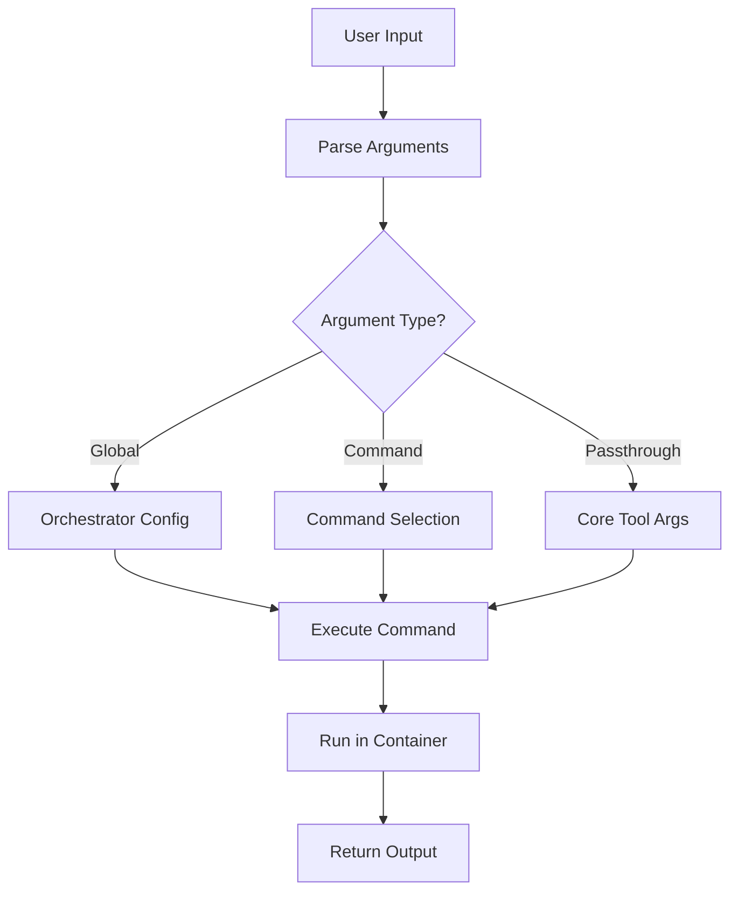

# CLI Reference

> **Complete command-line interface documentation**

## Table of Contents

- [Overview](#overview)
- [Global Options](#global-options)
- [Commands](#commands)
- [Examples](#examples)
- [Exit Codes](#exit-codes)

## Overview

The `color-scheme` CLI provides a container-based interface to the colorscheme-generator tool.

### Basic Syntax

```bash
color-scheme [GLOBAL_OPTIONS] COMMAND [COMMAND_OPTIONS] [ARGS]
```

### Command Structure

```
┌─────────────────────────────────────────────────────────────┐
│ color-scheme --runtime docker generate -i image.jpg        │
│ │            │              │           │                   │
│ │            │              │           └─ Core tool args   │
│ │            │              └─ Command                      │
│ │            └─ Global options                              │
│ └─ Program name                                             │
└─────────────────────────────────────────────────────────────┘
```

## Global Options

These options apply to all commands and control orchestrator behavior:

### `--runtime RUNTIME`

Specify container runtime to use.

```bash
color-scheme --runtime docker generate -i image.jpg
color-scheme --runtime podman generate -i image.jpg
```

**Values**: `docker`, `podman`  
**Default**: Auto-detect (tries Docker first, then Podman)  
**Environment**: `COLOR_SCHEME_RUNTIME`

### `--output-dir DIR`

Set output directory for generated color schemes.

```bash
color-scheme --output-dir ~/my-schemes generate -i image.jpg
```

**Default**: `/tmp/color-schemes`  
**Environment**: `COLOR_SCHEME_OUTPUT_DIR`

### `--config-dir DIR`

Set configuration directory.

```bash
color-scheme --config-dir ~/.config/my-app generate -i image.jpg
```

**Default**: `~/.config/color-scheme`  
**Environment**: `COLOR_SCHEME_CONFIG_DIR`

### `--cache-dir DIR`

Set cache directory.

```bash
color-scheme --cache-dir ~/.cache/my-app generate -i image.jpg
```

**Default**: `~/.cache/color-scheme` (or `$XDG_CACHE_HOME/color-scheme`)  
**Environment**: `COLOR_SCHEME_CACHE_DIR`

### `--verbose, -v`

Enable verbose output.

```bash
color-scheme -v generate -i image.jpg
color-scheme --verbose install
```

**Default**: `false`  
**Environment**: `COLOR_SCHEME_VERBOSE=true`

### `--debug, -d`

Enable debug output (includes verbose).

```bash
color-scheme -d generate -i image.jpg
color-scheme --debug install
```

**Default**: `false`  
**Environment**: `COLOR_SCHEME_DEBUG=true`

## Commands

### `install`

Build and initialize backend container images.

#### Syntax

```bash
color-scheme install [OPTIONS]
```

#### Options

##### `--force-rebuild`

Force rebuild of images even if they exist.

```bash
color-scheme install --force-rebuild
```

**Default**: `false`

#### Behavior

1. Detects available container runtime
2. Builds images for all configured backends
3. Runs initialization in containers
4. Reports success/failure for each backend

#### Output

```
INFO: Using container runtime: docker
INFO: Building container images...
INFO: Built image for pywal: sha256:abc123...
INFO: Built image for wallust: sha256:def456...
INFO: Installing backends in containers...
INFO: Successfully installed pywal
INFO: Successfully installed wallust

Installation results:
✓ pywal: success
✓ wallust: success

All backends installed successfully!
```

#### Exit Codes

- `0`: All backends installed successfully
- `1`: One or more backends failed to install

---

### `generate`

Generate a color scheme using a backend.

#### Syntax

```bash
color-scheme generate [CORE_TOOL_ARGS...]
```

#### Argument Passthrough

All arguments after `generate` are passed directly to the core tool running inside the container.

```bash
# These are equivalent:
color-scheme generate -i image.jpg --backend pywal
# Inside container: colorscheme-generator generate -i image.jpg --backend pywal
```

#### Common Core Tool Arguments

These arguments are handled by the core tool, not the orchestrator:

##### `-i, --image PATH`

Input image file.

```bash
color-scheme generate -i ~/wallpaper.jpg
```

##### `--backend BACKEND`

Backend to use for color extraction.

```bash
color-scheme generate -i image.jpg --backend pywal
color-scheme generate -i image.jpg --backend wallust
```

**Values**: `pywal`, `wallust`, `custom`  
**Default**: First configured backend

##### `--output-format FORMAT`

Output format for color scheme.

```bash
color-scheme generate -i image.jpg --output-format json
color-scheme generate -i image.jpg --output-format css
```

**Values**: `json`, `css`, `yaml`, `shell`, `gtk`, etc.

##### `--saturation FLOAT`

Adjust color saturation (0.0 to 1.0).

```bash
color-scheme generate -i image.jpg --saturation 0.8
```

##### `--help`

Show core tool help (not orchestrator help).

```bash
color-scheme generate --help
```

#### Behavior

1. Parses arguments to extract backend
2. Filters orchestrator-specific arguments
3. Prepares container configuration
4. Runs backend in container
5. Returns generated color scheme

#### Output

```
INFO: Generating color scheme in container...
INFO: Running pywal backend: colorscheme-generator generate -i image.jpg
{
  "colors": {
    "color0": "#1a1b26",
    "color1": "#f7768e",
    ...
  }
}
INFO: Color scheme generated successfully!
```

#### Exit Codes

- `0`: Generation successful
- `1`: Generation failed

---

### `show`

Display information about the orchestrator.

#### Syntax

```bash
color-scheme show [RESOURCE]
```

#### Resources

##### `backends` (default)

Show available backends.

```bash
color-scheme show backends
color-scheme show  # Same as above
```

**Output**:
```
=== Available Backends ===

Default backends (used when no --backend specified):
  • pywal
  • wallust

Supported backends:
  ● pywal: Fast color extraction from images using haishoku
  ● wallust: Color palette extraction optimized for wallpapers
  ○ custom: User-provided custom Python backend
```

##### `config`

Show current configuration.

```bash
color-scheme show config
```

**Output**:
```
=== Current Configuration ===

Directories:
  Output:    /tmp/color-schemes
  Config:    /home/user/.config/color-scheme
  Cache:     /home/user/.cache/color-scheme

Backends:
  • pywal
  • wallust

Container Settings:
  Timeout:       300s
  Memory limit:  512m

Runtime:
  Preferred: auto-detect

Logging:
  Verbose: False
  Debug:   False
```

##### `help`

Show help information.

```bash
color-scheme show help
```

#### Exit Codes

- `0`: Always (informational command)

---

### `status`

Show orchestrator system status.

#### Syntax

```bash
color-scheme status
```

#### Behavior

1. Checks container runtime availability
2. Lists built images
3. Verifies configuration paths

#### Output

```
=== Color Scheme Orchestrator Status ===

Container Runtime:
  ✓ DOCKER
    Version: Docker version 24.0.5
    Available: Yes

Built Images:
  ✓ color-scheme-pywal:latest
  ✓ color-scheme-wallust:latest

Configuration Paths:
  ✓ Output   /tmp/color-schemes
  ✓ Config   /home/user/.config/color-scheme
  ✓ Cache    /home/user/.cache/color-scheme
```

#### Exit Codes

- `0`: System healthy
- `1`: Issues found (no runtime, missing images, etc.)

## Examples

### Basic Usage

```bash
# Install backends
color-scheme install

# Generate with default backend
color-scheme generate -i wallpaper.jpg

# Generate with specific backend
color-scheme generate -i wallpaper.jpg --backend pywal
```

### Advanced Usage

```bash
# Use Podman instead of Docker
color-scheme --runtime podman generate -i image.jpg

# Custom output directory
color-scheme --output-dir ~/schemes generate -i image.jpg

# Debug mode
color-scheme --debug generate -i image.jpg

# Force rebuild images
color-scheme install --force-rebuild
```

### Combining Options

```bash
# Multiple global options
color-scheme --runtime docker --verbose --output-dir ~/schemes generate -i image.jpg

# Global options + core tool options
color-scheme -v generate -i image.jpg --backend pywal --saturation 0.9 --output-format json
```

### Environment Variables

```bash
# Set runtime preference
export COLOR_SCHEME_RUNTIME=podman
color-scheme generate -i image.jpg

# Set custom directories
export COLOR_SCHEME_OUTPUT_DIR=~/my-schemes
export COLOR_SCHEME_CONFIG_DIR=~/.config/my-app
color-scheme generate -i image.jpg

# Enable debug mode
export COLOR_SCHEME_DEBUG=true
color-scheme install
```

### Checking Status

```bash
# Check if everything is set up
color-scheme status

# Show available backends
color-scheme show backends

# Show current configuration
color-scheme show config
```

### Troubleshooting

```bash
# Debug installation issues
color-scheme --debug install

# Debug generation issues
color-scheme --debug generate -i image.jpg

# Check runtime availability
color-scheme status

# Get core tool help
color-scheme generate --help
```

## Exit Codes

### Standard Exit Codes

| Code | Meaning | Commands |
|------|---------|----------|
| `0` | Success | All commands |
| `1` | General failure | All commands |

### Command-Specific Exit Codes

#### `install`

- `0`: All backends installed successfully
- `1`: One or more backends failed

#### `generate`

- `0`: Color scheme generated successfully
- `1`: Generation failed (image not found, backend error, etc.)

#### `show`

- `0`: Always (informational)

#### `status`

- `0`: System healthy
- `1`: Issues detected

### Container Exit Codes

When a container fails, the exit code from the container is logged:

| Code | Meaning |
|------|---------|
| `0` | Success |
| `1` | General error |
| `2` | Misuse of shell command |
| `126` | Command cannot execute |
| `127` | Command not found |
| `137` | SIGKILL (OOM or timeout) |
| `143` | SIGTERM (graceful shutdown) |

## Argument Parsing

### Orchestrator vs Core Tool Arguments

```
┌─────────────────────────────────────────────────────────────┐
│ Orchestrator Arguments (handled by orchestrator)            │
├─────────────────────────────────────────────────────────────┤
│ --runtime, --output-dir, --config-dir, --cache-dir          │
│ --verbose, -v, --debug, -d                                  │
└─────────────────────────────────────────────────────────────┘

┌─────────────────────────────────────────────────────────────┐
│ Core Tool Arguments (passed to container)                   │
├─────────────────────────────────────────────────────────────┤
│ -i, --image, --backend, --output-format, --saturation       │
│ All other unrecognized arguments                            │
└─────────────────────────────────────────────────────────────┘
```

### Parsing Flow



### Example Parsing

```bash
color-scheme --runtime docker --verbose generate -i image.jpg --backend pywal --saturation 0.8
```

**Parsed as**:

```python
{
    # Orchestrator arguments
    "runtime": "docker",
    "verbose": True,

    # Command
    "command": "generate",

    # Core tool arguments (passthrough)
    "passthrough": ["-i", "image.jpg", "--backend", "pywal", "--saturation", "0.8"]
}
```

## Help System

### Orchestrator Help

```bash
# Show orchestrator help
color-scheme --help
color-scheme -h

# Show command help
color-scheme install --help
color-scheme generate --help
```

### Core Tool Help

```bash
# Show core tool help (runs in container)
color-scheme generate --help
```

**Note**: The `generate` command passes `--help` to the core tool, so you see the core tool's help, not the orchestrator's.

## Configuration Precedence

Arguments are resolved in this order (highest to lowest priority):

```
1. Command-line arguments
   └─ color-scheme --runtime docker

2. Environment variables
   └─ export COLOR_SCHEME_RUNTIME=docker

3. Configuration files (future)
   └─ ~/.config/color-scheme/config.toml

4. Defaults
   └─ Auto-detect runtime
```

### Example

```bash
# Environment variable
export COLOR_SCHEME_RUNTIME=podman

# Command-line overrides environment
color-scheme --runtime docker generate -i image.jpg
# Uses: docker (not podman)
```

---

**Next**: [Configuration Guide](configuration.md) | [Argument Passthrough](argument-passthrough.md)

