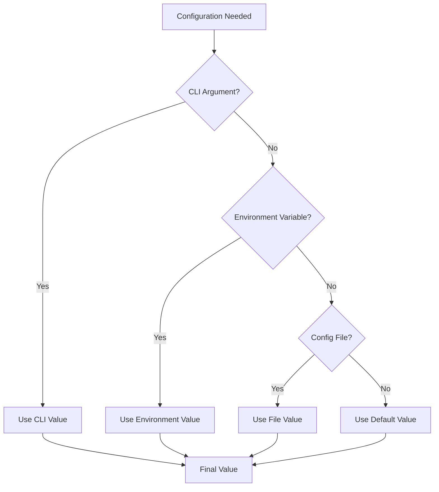

# Configuration Guide

> **Complete guide to orchestrator configuration**

## Table of Contents

- [Overview](#overview)
- [Configuration Sources](#configuration-sources)
- [Configuration Options](#configuration-options)
- [Environment Variables](#environment-variables)
- [Configuration Precedence](#configuration-precedence)
- [Examples](#examples)

## Overview

The orchestrator can be configured through multiple sources with a clear precedence order. This allows flexibility for different use cases while maintaining sensible defaults.

## Configuration Sources

```
┌─────────────────────────────────────────────────────────────┐
│ Configuration Precedence (Highest to Lowest)                │
├─────────────────────────────────────────────────────────────┤
│                                                             │
│ 1. Command-line Arguments                                  │
│    └─ color-scheme --runtime docker                        │
│                                                             │
│ 2. Environment Variables                                   │
│    └─ export COLOR_SCHEME_RUNTIME=docker                   │
│                                                             │
│ 3. Configuration Files (future)                            │
│    └─ ~/.config/color-scheme/config.toml                   │
│                                                             │
│ 4. Defaults                                                │
│    └─ Hardcoded in config/constants.py                     │
│                                                             │
└─────────────────────────────────────────────────────────────┘
```

### Precedence Example

```bash
# Default: Auto-detect runtime
color-scheme generate -i image.jpg
# Uses: Auto-detected (Docker or Podman)

# Environment variable
export COLOR_SCHEME_RUNTIME=podman
color-scheme generate -i image.jpg
# Uses: podman

# Command-line overrides environment
color-scheme --runtime docker generate -i image.jpg
# Uses: docker (not podman)
```

## Configuration Options

### OrchestratorConfig Class

```python
@dataclass
class OrchestratorConfig:
    """Configuration for the orchestrator."""
    
    # Runtime configuration
    runtime: Optional[str] = None
    runtime_path: Optional[str] = None
    
    # Backend configuration
    backends: list[str] = ["pywal", "wallust"]
    
    # Directory configuration
    output_dir: Path = Path("/tmp/color-schemes")
    config_dir: Path = Path("~/.config/color-scheme")
    cache_dir: Path = Path("~/.cache/color-scheme")
    
    # Container configuration
    container_timeout: int = 300
    container_memory_limit: Optional[str] = "512m"
    container_cpuset_cpus: Optional[str] = None
    
    # Logging configuration
    verbose: bool = False
    debug: bool = False
```

### Configuration Categories

```
┌─────────────────────────────────────────────────────────────┐
│ Runtime Configuration                                       │
├─────────────────────────────────────────────────────────────┤
│ runtime              Container runtime (docker/podman)      │
│ runtime_path         Custom path to runtime binary          │
└─────────────────────────────────────────────────────────────┘

┌─────────────────────────────────────────────────────────────┐
│ Backend Configuration                                       │
├─────────────────────────────────────────────────────────────┤
│ backends             List of default backends               │
└─────────────────────────────────────────────────────────────┘

┌─────────────────────────────────────────────────────────────┐
│ Directory Configuration                                     │
├─────────────────────────────────────────────────────────────┤
│ output_dir           Where to save generated schemes        │
│ config_dir           Configuration storage                  │
│ cache_dir            Cache storage                          │
└─────────────────────────────────────────────────────────────┘

┌─────────────────────────────────────────────────────────────┐
│ Container Configuration                                     │
├─────────────────────────────────────────────────────────────┤
│ container_timeout    Max execution time (seconds)           │
│ container_memory_limit  Memory limit (e.g., "512m")         │
│ container_cpuset_cpus   CPU affinity (e.g., "0-3")          │
└─────────────────────────────────────────────────────────────┘

┌─────────────────────────────────────────────────────────────┐
│ Logging Configuration                                       │
├─────────────────────────────────────────────────────────────┤
│ verbose              Enable verbose output                  │
│ debug                Enable debug output                    │
└─────────────────────────────────────────────────────────────┘
```

## Configuration Options Reference

### Runtime Options

#### `runtime`

**Type**: `str | None`  
**Default**: `None` (auto-detect)  
**Values**: `"docker"`, `"podman"`, `None`  
**CLI**: `--runtime RUNTIME`  
**Env**: `COLOR_SCHEME_RUNTIME`

Specifies which container runtime to use. If `None`, the orchestrator auto-detects available runtimes in order: Docker, then Podman.

```bash
# CLI
color-scheme --runtime docker generate -i image.jpg

# Environment
export COLOR_SCHEME_RUNTIME=podman
```

#### `runtime_path`

**Type**: `str | None`  
**Default**: `None` (use PATH)  
**CLI**: Not available  
**Env**: `COLOR_SCHEME_RUNTIME_PATH`

Custom path to the container runtime binary.

```bash
export COLOR_SCHEME_RUNTIME_PATH=/usr/local/bin/docker
```

### Backend Options

#### `backends`

**Type**: `list[str]`  
**Default**: `["pywal", "wallust"]`  
**CLI**: Not available (use `--backend` in generate command)  
**Env**: Not available

List of default backends to install and use.

```python
# In code
config = OrchestratorConfig(backends=["pywal", "custom"])
```

### Directory Options

#### `output_dir`

**Type**: `Path`  
**Default**: `/tmp/color-schemes`  
**CLI**: `--output-dir DIR`  
**Env**: `COLOR_SCHEME_OUTPUT_DIR`

Directory where generated color schemes are saved.

```bash
# CLI
color-scheme --output-dir ~/schemes generate -i image.jpg

# Environment
export COLOR_SCHEME_OUTPUT_DIR=~/my-schemes
```

#### `config_dir`

**Type**: `Path`  
**Default**: `~/.config/color-scheme`  
**CLI**: `--config-dir DIR`  
**Env**: `COLOR_SCHEME_CONFIG_DIR`

Directory for configuration files.

```bash
# CLI
color-scheme --config-dir ~/.config/my-app generate -i image.jpg

# Environment
export COLOR_SCHEME_CONFIG_DIR=~/.config/my-app
```

#### `cache_dir`

**Type**: `Path`  
**Default**: `~/.cache/color-scheme` (or `$XDG_CACHE_HOME/color-scheme`)  
**CLI**: `--cache-dir DIR`  
**Env**: `COLOR_SCHEME_CACHE_DIR`

Directory for cache files.

```bash
# CLI
color-scheme --cache-dir ~/.cache/my-app generate -i image.jpg

# Environment
export COLOR_SCHEME_CACHE_DIR=~/.cache/my-app
```

### Container Options

#### `container_timeout`

**Type**: `int`
**Default**: `300` (5 minutes)
**CLI**: Not available
**Env**: `COLOR_SCHEME_CONTAINER_TIMEOUT`

Maximum time (in seconds) a container can run before being forcefully stopped.

```bash
export COLOR_SCHEME_CONTAINER_TIMEOUT=600  # 10 minutes
```

**Behavior**:
- Container runs normally until timeout
- At timeout: Container is stopped (SIGTERM)
- After grace period: Container is killed (SIGKILL)
- Exit code 143 (SIGTERM) or 137 (SIGKILL)

#### `container_memory_limit`

**Type**: `str | None`
**Default**: `"512m"`
**CLI**: Not available
**Env**: `COLOR_SCHEME_CONTAINER_MEMORY_LIMIT`

Memory limit for containers.

```bash
export COLOR_SCHEME_CONTAINER_MEMORY_LIMIT=1g
export COLOR_SCHEME_CONTAINER_MEMORY_LIMIT=256m
```

**Format**: `<number><unit>` where unit is `b`, `k`, `m`, or `g`

**Behavior**:
- Container killed if exceeds limit
- Exit code 137 (SIGKILL)
- OOM (Out of Memory) error in logs

#### `container_cpuset_cpus`

**Type**: `str | None`
**Default**: `None` (no limit)
**CLI**: Not available
**Env**: `COLOR_SCHEME_CONTAINER_CPUSET_CPUS`

CPU affinity for containers.

```bash
export COLOR_SCHEME_CONTAINER_CPUSET_CPUS="0-3"  # Use CPUs 0-3
export COLOR_SCHEME_CONTAINER_CPUSET_CPUS="0,2"  # Use CPUs 0 and 2
```

### Logging Options

#### `verbose`

**Type**: `bool`
**Default**: `False`
**CLI**: `--verbose`, `-v`
**Env**: `COLOR_SCHEME_VERBOSE=true`

Enable verbose logging output.

```bash
# CLI
color-scheme -v generate -i image.jpg
color-scheme --verbose install

# Environment
export COLOR_SCHEME_VERBOSE=true
```

**Output Level**: INFO and above

#### `debug`

**Type**: `bool`
**Default**: `False`
**CLI**: `--debug`, `-d`
**Env**: `COLOR_SCHEME_DEBUG=true`

Enable debug logging output (includes verbose).

```bash
# CLI
color-scheme -d generate -i image.jpg
color-scheme --debug install

# Environment
export COLOR_SCHEME_DEBUG=true
```

**Output Level**: DEBUG and above (most detailed)

## Environment Variables

### Complete Reference

| Variable | Type | Default | Description |
|----------|------|---------|-------------|
| `COLOR_SCHEME_RUNTIME` | string | auto-detect | Container runtime |
| `COLOR_SCHEME_RUNTIME_PATH` | string | None | Custom runtime path |
| `COLOR_SCHEME_OUTPUT_DIR` | path | `/tmp/color-schemes` | Output directory |
| `COLOR_SCHEME_CONFIG_DIR` | path | `~/.config/color-scheme` | Config directory |
| `COLOR_SCHEME_CACHE_DIR` | path | `~/.cache/color-scheme` | Cache directory |
| `COLOR_SCHEME_CONTAINER_TIMEOUT` | int | 300 | Container timeout (seconds) |
| `COLOR_SCHEME_CONTAINER_MEMORY_LIMIT` | string | "512m" | Memory limit |
| `COLOR_SCHEME_CONTAINER_CPUSET_CPUS` | string | None | CPU affinity |
| `COLOR_SCHEME_VERBOSE` | bool | false | Verbose logging |
| `COLOR_SCHEME_DEBUG` | bool | false | Debug logging |

### Environment Variable Format

```bash
# Boolean values
export COLOR_SCHEME_VERBOSE=true   # or "1", "yes", "on"
export COLOR_SCHEME_DEBUG=false    # or "0", "no", "off"

# String values
export COLOR_SCHEME_RUNTIME=docker

# Path values (tilde expansion supported)
export COLOR_SCHEME_OUTPUT_DIR=~/schemes
export COLOR_SCHEME_CONFIG_DIR=~/.config/my-app

# Integer values
export COLOR_SCHEME_CONTAINER_TIMEOUT=600

# Memory values
export COLOR_SCHEME_CONTAINER_MEMORY_LIMIT=1g
```

## Configuration Precedence

### Resolution Order



### Precedence Examples

#### Example 1: Runtime Selection

```bash
# Scenario: All sources specify runtime
DEFAULT="auto-detect"
ENV="podman"
CLI="docker"

# Result: docker (CLI wins)
color-scheme --runtime docker generate -i image.jpg
```

#### Example 2: Output Directory

```bash
# Scenario: Only environment and default
DEFAULT="/tmp/color-schemes"
ENV="~/my-schemes"

# Result: ~/my-schemes (environment wins)
export COLOR_SCHEME_OUTPUT_DIR=~/my-schemes
color-scheme generate -i image.jpg
```

#### Example 3: Mixed Configuration

```bash
# Set some via environment
export COLOR_SCHEME_RUNTIME=podman
export COLOR_SCHEME_OUTPUT_DIR=~/schemes

# Override runtime via CLI
color-scheme --runtime docker --verbose generate -i image.jpg

# Final configuration:
# - runtime: docker (CLI override)
# - output_dir: ~/schemes (from environment)
# - verbose: true (from CLI)
# - debug: false (default)
```

## Examples

### Basic Configuration

```bash
# Use defaults
color-scheme generate -i image.jpg

# Override runtime
color-scheme --runtime podman generate -i image.jpg

# Enable verbose mode
color-scheme -v generate -i image.jpg
```

### Environment-Based Configuration

```bash
# Create .env file
cat > .env << EOF
COLOR_SCHEME_RUNTIME=docker
COLOR_SCHEME_OUTPUT_DIR=~/color-schemes
COLOR_SCHEME_CACHE_DIR=~/.cache/my-app
COLOR_SCHEME_VERBOSE=true
EOF

# Load and use
source .env
color-scheme generate -i image.jpg
```

### Development Configuration

```bash
# Development settings
export COLOR_SCHEME_DEBUG=true
export COLOR_SCHEME_CONTAINER_TIMEOUT=600
export COLOR_SCHEME_OUTPUT_DIR=./output

color-scheme install --force-rebuild
color-scheme generate -i test.jpg
```

### Production Configuration

```bash
# Production settings
export COLOR_SCHEME_RUNTIME=docker
export COLOR_SCHEME_CONTAINER_MEMORY_LIMIT=1g
export COLOR_SCHEME_CONTAINER_TIMEOUT=300
export COLOR_SCHEME_OUTPUT_DIR=/var/lib/color-schemes

color-scheme generate -i image.jpg
```

### CI/CD Configuration

```bash
# CI/CD pipeline
export COLOR_SCHEME_RUNTIME=docker
export COLOR_SCHEME_OUTPUT_DIR=/tmp/ci-schemes
export COLOR_SCHEME_CACHE_DIR=/tmp/ci-cache
export COLOR_SCHEME_VERBOSE=true

# Install once
color-scheme install

# Generate multiple
for img in images/*.jpg; do
    color-scheme generate -i "$img"
done
```

## Configuration Loading

### Initialization Flow

```python
# 1. Create default config
config = OrchestratorConfig.default()

# 2. Load from environment
config = OrchestratorConfig.from_env()

# 3. Override with CLI arguments
if args.runtime:
    config.runtime = args.runtime
if args.verbose:
    config.verbose = True
if args.debug:
    config.debug = True
```

### Configuration Methods

```python
# Default configuration
config = OrchestratorConfig.default()

# From environment variables
config = OrchestratorConfig.from_env()

# Custom configuration
config = OrchestratorConfig(
    runtime="docker",
    output_dir=Path("~/schemes"),
    verbose=True,
)
```

## Default Values

### Constants (config/constants.py)

```python
# Backend versions
BACKEND_VERSIONS = {
    "pywal": {
        "version": "3.3.0",
        "base_image": "python:3.12-slim-bookworm",
    },
    "wallust": {
        "version": "2.6.0",
        "base_image": "alpine:3.20",
    },
}

# Environment defaults
DEFAULT_BACKENDS = ["pywal", "wallust"]
DEFAULT_OUTPUT_DIR = "/tmp/color-schemes"
DEFAULT_CONFIG_DIR = "/root/.config/color-scheme"

# Container settings
CONTAINER_TIMEOUT = 300  # 5 minutes
CONTAINER_MEMORY_LIMIT = "512m"
CONTAINER_CPUSET_CPUS = None

# Volume mount points
VOLUME_PATHS = {
    "output": "/tmp/color-schemes",
    "cache": "/root/.cache",
    "config": "/root/.config",
}

# Runtime detection order
RUNTIME_DETECTION_ORDER = ["docker", "podman"]
```

## Best Practices

### 1. Use Environment Variables for Deployment

```bash
# ✅ Good: Environment-based configuration
export COLOR_SCHEME_RUNTIME=docker
export COLOR_SCHEME_OUTPUT_DIR=/var/lib/schemes

# ❌ Bad: Hardcoded in scripts
color-scheme --runtime docker --output-dir /var/lib/schemes
```

### 2. Use CLI Arguments for One-Off Changes

```bash
# ✅ Good: Override for single run
color-scheme --runtime podman generate -i image.jpg

# ❌ Bad: Change environment for single run
export COLOR_SCHEME_RUNTIME=podman
color-scheme generate -i image.jpg
unset COLOR_SCHEME_RUNTIME
```

### 3. Set Resource Limits in Production

```bash
# ✅ Good: Prevent resource exhaustion
export COLOR_SCHEME_CONTAINER_MEMORY_LIMIT=1g
export COLOR_SCHEME_CONTAINER_TIMEOUT=300

# ❌ Bad: Unlimited resources
# (uses defaults, which are reasonable)
```

### 4. Enable Debug Mode for Troubleshooting

```bash
# ✅ Good: Debug specific issue
color-scheme --debug generate -i image.jpg

# ❌ Bad: Always debug mode
export COLOR_SCHEME_DEBUG=true  # In production
```

### 5. Use Consistent Directory Structure

```bash
# ✅ Good: Organized directories
export COLOR_SCHEME_OUTPUT_DIR=~/.local/share/color-schemes
export COLOR_SCHEME_CONFIG_DIR=~/.config/color-scheme
export COLOR_SCHEME_CACHE_DIR=~/.cache/color-scheme

# ❌ Bad: Mixed locations
export COLOR_SCHEME_OUTPUT_DIR=/tmp/output
export COLOR_SCHEME_CONFIG_DIR=~/config
export COLOR_SCHEME_CACHE_DIR=/var/cache
```

---

**Next**: [Runtime Detection](runtime-detection.md) | [Argument Passthrough](argument-passthrough.md)

