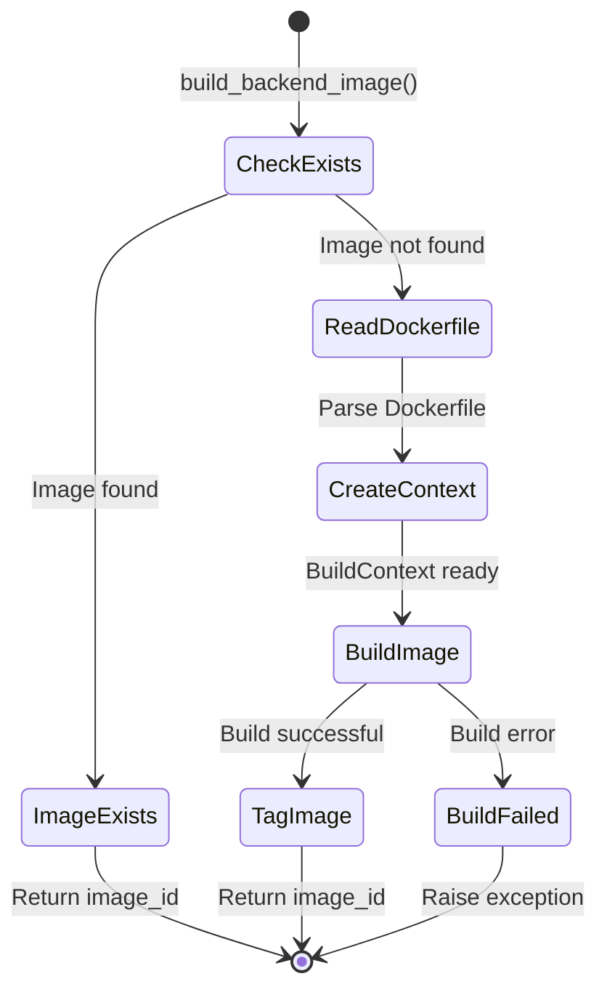
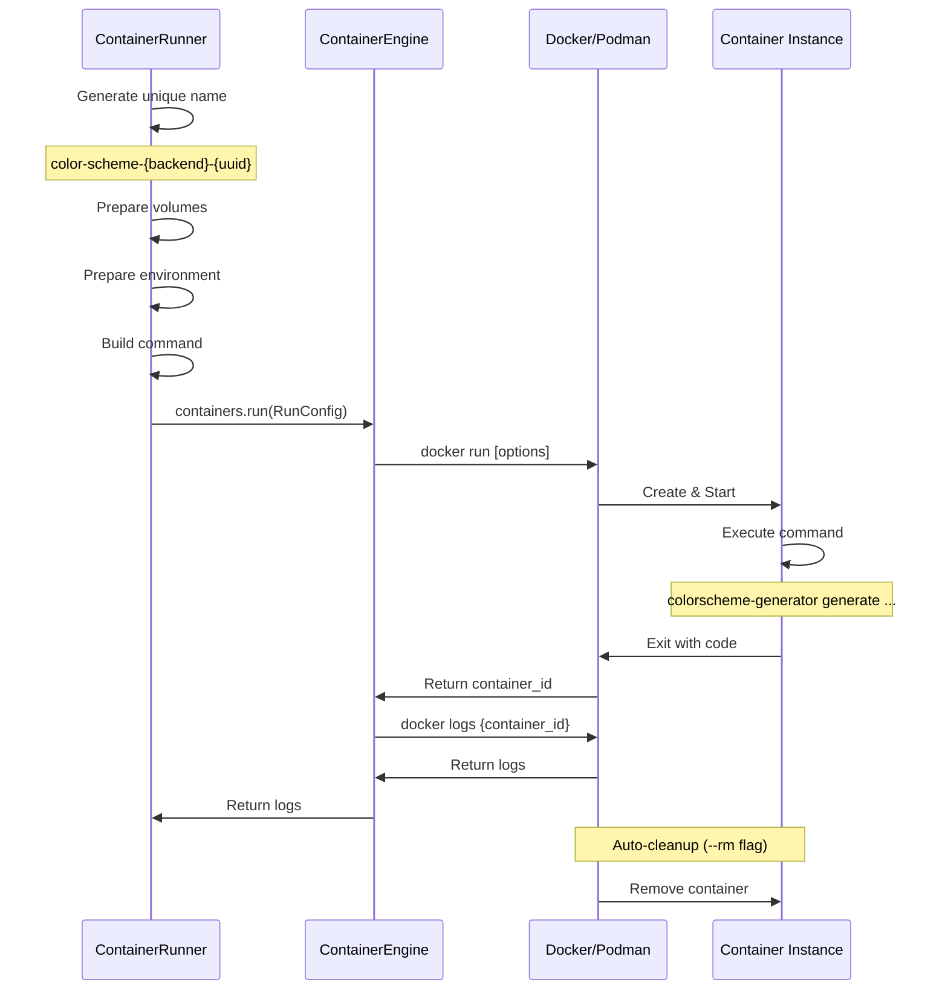
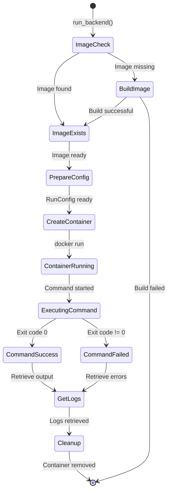

# Container Lifecycle

> **Detailed documentation of container operations and state management**

## Table of Contents

- [Overview](#overview)
- [Image Lifecycle](#image-lifecycle)
- [Container Lifecycle](#container-lifecycle)
- [Volume Management](#volume-management)
- [State Transitions](#state-transitions)
- [Resource Management](#resource-management)

## Overview

The orchestrator manages the complete lifecycle of container images and running containers. This document details every stage from image building to container cleanup.

## Image Lifecycle

### Image Building Process



### Image Build Flow

```
┌─────────────────────────────────────────────────────────────┐
│ 1. Check if Image Exists                                    │
│    ├─ Call: engine.images.inspect(image_name)              │
│    ├─ If exists and not force_rebuild: Return early        │
│    └─ If not exists: Continue to build                     │
└─────────────────────────────────────────────────────────────┘
                           ↓
┌─────────────────────────────────────────────────────────────┐
│ 2. Locate Dockerfile                                        │
│    ├─ Backend: pywal → docker/Dockerfile.pywal             │
│    ├─ Backend: wallust → docker/Dockerfile.wallust         │
│    └─ Backend: custom → docker/Dockerfile.custom           │
└─────────────────────────────────────────────────────────────┘
                           ↓
┌─────────────────────────────────────────────────────────────┐
│ 3. Read Dockerfile Content                                  │
│    └─ Load entire file into memory                         │
└─────────────────────────────────────────────────────────────┘
                           ↓
┌─────────────────────────────────────────────────────────────┐
│ 4. Create Build Context                                     │
│    ├─ BuildContext(                                         │
│    │     dockerfile=content,                               │
│    │     files={},  # Additional files if needed           │
│    │  )                                                     │
│    └─ For custom backend: Include backend.py script        │
└─────────────────────────────────────────────────────────────┘
                           ↓
┌─────────────────────────────────────────────────────────────┐
│ 5. Execute Build                                            │
│    ├─ Call: engine.images.build(context, image_name)       │
│    ├─ Docker/Podman executes multi-stage build             │
│    └─ Returns: image_id                                    │
└─────────────────────────────────────────────────────────────┘
                           ↓
┌─────────────────────────────────────────────────────────────┐
│ 6. Tag and Cache                                            │
│    ├─ Tag: color-scheme-{backend}:latest                   │
│    └─ Image cached for future use                          │
└─────────────────────────────────────────────────────────────┘
```

### Multi-Stage Build Optimization

All backend Dockerfiles use multi-stage builds:

```dockerfile
# Stage 1: Builder (large, includes build tools)
FROM python:3.12-slim-bookworm AS builder
RUN apt-get install gcc g++ make
RUN pip install pywal==3.3.0

# Stage 2: Runtime (small, only runtime deps)
FROM python:3.12-slim-bookworm
COPY --from=builder /opt/venv /opt/venv
# No build tools in final image
```

**Benefits**:
- ✅ Smaller final image size (300MB vs 800MB)
- ✅ Faster container startup
- ✅ Reduced attack surface
- ✅ Layer caching for dependencies

### Image Naming Convention

```
Format: color-scheme-{backend}:latest

Examples:
  - color-scheme-pywal:latest
  - color-scheme-wallust:latest
  - color-scheme-custom:latest
```

## Container Lifecycle

### Container Execution Flow



### Container States

```
┌─────────────┐
│   CREATED   │  Container created but not started
└──────┬──────┘
       │ docker run
       ↓
┌─────────────┐
│   RUNNING   │  Container executing command
└──────┬──────┘
       │ Command completes
       ↓
┌─────────────┐
│   EXITED    │  Container stopped (exit code available)
└──────┬──────┘
       │ Auto-cleanup (--rm)
       ↓
┌─────────────┐
│   REMOVED   │  Container deleted
└─────────────┘
```

### RunConfig Parameters

```python
RunConfig(
    # Required
    image="color-scheme-pywal:latest",
    
    # Identity
    name="color-scheme-pywal-a1b2c3d4",  # Unique name
    
    # Execution
    command=["colorscheme-generator", "generate", "-i", "image.jpg"],
    entrypoint=None,  # Use image's ENTRYPOINT
    
    # Environment
    environment={
        "HOME": "/root",
        "PYTHONUNBUFFERED": "1",
        "DISPLAY": ":0",  # Passthrough from host
    },
    
    # Filesystem
    volumes=[
        VolumeMount(
            source="/home/user/.cache/color-scheme",
            target="/root/.cache/color-scheme",
            read_only=False,
        ),
    ],
    working_dir=None,  # Use image's WORKDIR
    
    # Security
    user="1000:1000",  # Run as host user
    read_only=False,
    privileged=False,
    
    # Behavior
    detach=False,  # Wait for completion
    remove=True,   # Auto-cleanup
    
    # Resources (from config)
    memory_limit="512m",
    cpu_limit=None,
)
```

### Container Naming Strategy

```python
# Format: color-scheme-{backend}-{random_8_chars}
container_name = f"color-scheme-{backend}-{uuid.uuid4().hex[:8]}"

# Examples:
# - color-scheme-pywal-a1b2c3d4
# - color-scheme-wallust-f9e8d7c6
# - color-scheme-custom-12345678
```

**Why unique names?**
- ✅ Prevents name conflicts
- ✅ Allows parallel execution
- ✅ Easy to identify in logs
- ✅ Automatic cleanup tracking

## Volume Management

### Volume Mount Strategy

The orchestrator mounts three directories into containers:

```
Host System                    Container
─────────────────────────────────────────────────────────────
~/.cache/color-scheme    →    /root/.cache/color-scheme
  (Cache directory)             (Backend cache)

~/.config/color-scheme   →    /root/.config/color-scheme
  (Config directory)            (Backend config)

/tmp/color-schemes       →    /tmp/color-schemes
  (Output directory)            (Generated schemes)
```

### Volume Mount Implementation

```python
def _prepare_volume_mounts(self) -> list[VolumeMount]:
    """Prepare volume mounts for container."""
    mounts = []

    # 1. Output directory (read-write)
    if self.config.output_dir:
        self.config.output_dir.mkdir(parents=True, exist_ok=True)
        mounts.append(
            VolumeMount(
                source=str(self.config.output_dir),
                target="/tmp/color-schemes",
                read_only=False,
            )
        )

    # 2. Cache directory (read-write)
    if self.config.cache_dir:
        self.config.cache_dir.mkdir(parents=True, exist_ok=True)
        mounts.append(
            VolumeMount(
                source=str(self.config.cache_dir),
                target="/root/.cache/color-scheme",
                read_only=False,
            )
        )

    # 3. Config directory (read-write)
    if self.config.config_dir:
        self.config.config_dir.mkdir(parents=True, exist_ok=True)
        mounts.append(
            VolumeMount(
                source=str(self.config.config_dir),
                target="/root/.config/color-scheme",
                read_only=False,
            )
        )

    return mounts
```

### Volume Permissions

```
┌─────────────────────────────────────────────────────────────┐
│ Permission Strategy                                         │
├─────────────────────────────────────────────────────────────┤
│                                                             │
│ Container runs as: user={os.getuid()}:{os.getgid()}        │
│                                                             │
│ This ensures:                                               │
│   ✓ Files created in container owned by host user          │
│   ✓ No permission issues accessing mounted volumes         │
│   ✓ No root-owned files on host system                     │
│                                                             │
└─────────────────────────────────────────────────────────────┘
```

## State Transitions

### Complete Lifecycle State Machine



### Error Handling States

```
┌─────────────────────────────────────────────────────────────┐
│ Error State: Image Build Failed                             │
├─────────────────────────────────────────────────────────────┤
│ Trigger: Docker build command fails                         │
│ Action: Log error, raise ImageBuildError                    │
│ Recovery: User must fix Dockerfile or dependencies          │
└─────────────────────────────────────────────────────────────┘

┌─────────────────────────────────────────────────────────────┐
│ Error State: Container Execution Failed                     │
├─────────────────────────────────────────────────────────────┤
│ Trigger: Container exits with non-zero code                 │
│ Action: Capture logs, raise RuntimeError                    │
│ Recovery: Check logs for backend-specific errors            │
└─────────────────────────────────────────────────────────────┘

┌─────────────────────────────────────────────────────────────┐
│ Error State: Volume Mount Failed                            │
├─────────────────────────────────────────────────────────────┤
│ Trigger: Directory doesn't exist or no permissions          │
│ Action: Create directory or raise PermissionError           │
│ Recovery: Fix directory permissions                         │
└─────────────────────────────────────────────────────────────┘
```

## Resource Management

### Memory Limits

```python
# From config/constants.py
CONTAINER_MEMORY_LIMIT = "512m"

# Applied in RunConfig
config = RunConfig(
    memory_limit=self.config.container_memory_limit,  # "512m"
)
```

**Memory limit behavior**:
- Container killed if exceeds limit
- OOM (Out of Memory) error logged
- Exit code 137 (SIGKILL)

### CPU Limits

```python
# From config/constants.py
CONTAINER_CPUSET_CPUS = None  # No limit by default

# Can be configured via environment
export COLOR_SCHEME_CONTAINER_CPUSET_CPUS="0-3"  # Use CPUs 0-3
```

### Timeout Management

```python
# From config/constants.py
CONTAINER_TIMEOUT = 300  # 5 minutes

# Applied during container execution
# If container runs longer than timeout:
#   - Container is forcefully stopped
#   - Cleanup is performed
#   - TimeoutError is raised
```

### Resource Cleanup

```
┌─────────────────────────────────────────────────────────────┐
│ Automatic Cleanup (--rm flag)                               │
├─────────────────────────────────────────────────────────────┤
│ When: Container exits (success or failure)                  │
│ What: Container filesystem and metadata removed             │
│ Why: Prevents disk space accumulation                       │
└─────────────────────────────────────────────────────────────┘

┌─────────────────────────────────────────────────────────────┐
│ Manual Cleanup (cleanup_container method)                   │
├─────────────────────────────────────────────────────────────┤
│ When: Explicit call or error recovery                       │
│ What: Stop and remove container by name                     │
│ Why: Handle stuck or orphaned containers                    │
└─────────────────────────────────────────────────────────────┘

┌─────────────────────────────────────────────────────────────┐
│ Image Cleanup (remove_image method)                         │
├─────────────────────────────────────────────────────────────┤
│ When: User explicitly removes backend                       │
│ What: Delete image and free disk space                      │
│ Why: Manage disk usage                                      │
└─────────────────────────────────────────────────────────────┘
```

### Cleanup Implementation

```python
def cleanup_container(self, container_name: str) -> None:
    """Clean up a container by name."""
    try:
        # 1. Find container by name
        containers = self.engine.containers.list()
        container_id = None

        for container in containers:
            if container_name in str(container):
                container_id = container
                break

        if container_id:
            # 2. Stop container (if running)
            self.engine.containers.stop(container_id)

            # 3. Remove container
            self.engine.containers.remove(container_id)

            logger.info(f"Cleaned up container: {container_name}")
    except Exception as e:
        logger.warning(f"Failed to cleanup container: {e}")
```

## Best Practices

### 1. Always Use Unique Names

```python
# ✅ Good: Unique name per execution
container_name = f"color-scheme-{backend}-{uuid.uuid4().hex[:8]}"

# ❌ Bad: Static name causes conflicts
container_name = f"color-scheme-{backend}"
```

### 2. Enable Auto-Cleanup

```python
# ✅ Good: Auto-cleanup enabled
RunConfig(remove=True)

# ❌ Bad: Manual cleanup required
RunConfig(remove=False)
```

### 3. Set Resource Limits

```python
# ✅ Good: Prevent resource exhaustion
RunConfig(
    memory_limit="512m",
    cpu_limit="1.0",
)

# ❌ Bad: Unlimited resources
RunConfig(
    memory_limit=None,
    cpu_limit=None,
)
```

### 4. Run as Non-Root

```python
# ✅ Good: Run as host user
RunConfig(user=f"{os.getuid()}:{os.getgid()}")

# ❌ Bad: Run as root
RunConfig(user="root")
```

### 5. Use Detach=False for Short Tasks

```python
# ✅ Good: Wait for completion
RunConfig(detach=False)  # Blocks until done

# ❌ Bad: Detach for short tasks
RunConfig(detach=True)  # Requires polling
```

---

**Next**: [CLI Reference](cli-reference.md) | [Configuration Guide](configuration.md)

