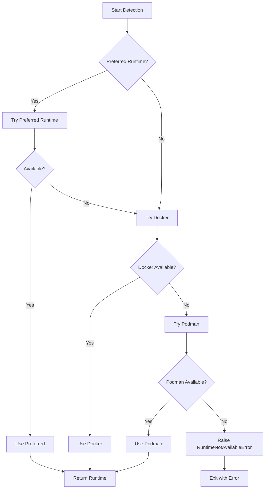
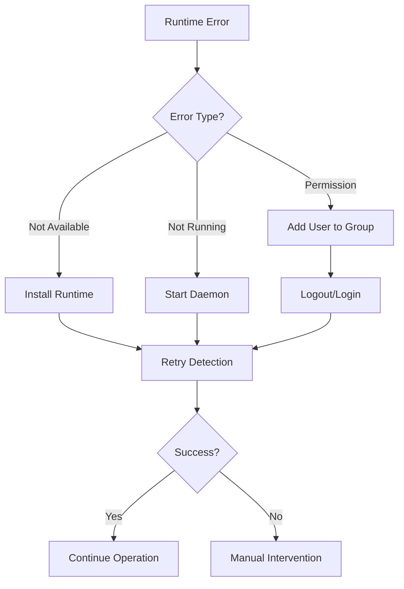

# Runtime Detection

> **Docker and Podman detection and selection logic**

## Table of Contents

- [Overview](#overview)
- [Detection Algorithm](#detection-algorithm)
- [Runtime Selection](#runtime-selection)
- [Verification Process](#verification-process)
- [Error Handling](#error-handling)

## Overview

The orchestrator supports both Docker and Podman as container runtimes. It automatically detects which runtime is available on the system and uses it transparently.

### Supported Runtimes

```
┌─────────────────────────────────────────────────────────────┐
│ Docker                                                      │
├─────────────────────────────────────────────────────────────┤
│ Version: ≥ 20.10                                            │
│ Command: docker                                             │
│ Priority: 1st (checked first)                               │
└─────────────────────────────────────────────────────────────┘

┌─────────────────────────────────────────────────────────────┐
│ Podman                                                      │
├─────────────────────────────────────────────────────────────┤
│ Version: ≥ 3.0                                              │
│ Command: podman                                             │
│ Priority: 2nd (fallback)                                    │
└─────────────────────────────────────────────────────────────┘
```

### Runtime Compatibility

Both runtimes use the same API through the `container-manager` library:

```python
# Same code works for both Docker and Podman
engine = ContainerEngineFactory.create(runtime)
engine.images.build(context, tag)
engine.containers.run(config)
```

## Detection Algorithm

### Detection Flow



### Detection Order

```python
# From config/constants.py
RUNTIME_DETECTION_ORDER = ["docker", "podman"]

# Detection tries in order:
# 1. Preferred runtime (if specified)
# 2. Docker
# 3. Podman
# 4. Error if none available
```

### Detection Implementation

```python
def detect_container_runtime(
    preferred_runtime: Optional[str] = None,
) -> ContainerRuntime:
    """
    Detect available container runtime.
    
    Args:
        preferred_runtime: Preferred runtime ("docker" or "podman")
    
    Returns:
        Detected ContainerRuntime
    
    Raises:
        RuntimeNotAvailableError: If no runtime is available
    """
    runtimes_to_try: list[str] = []
    
    # 1. Add preferred runtime first if specified
    if preferred_runtime:
        if preferred_runtime.lower() in ("docker", "podman"):
            runtimes_to_try.append(preferred_runtime.lower())
        else:
            logger.warning(
                f"Unknown runtime preference: {preferred_runtime}. "
                f"Falling back to auto-detection."
            )
    
    # 2. Add detection order
    runtimes_to_try.extend(RUNTIME_DETECTION_ORDER)
    
    # 3. Try each runtime
    for runtime_name in runtimes_to_try:
        try:
            if runtime_name.lower() == "docker":
                runtime = ContainerRuntime.DOCKER
            elif runtime_name.lower() == "podman":
                runtime = ContainerRuntime.PODMAN
            else:
                continue
            
            # Try to create engine - this will fail if not available
            engine = ContainerEngineFactory.create(runtime)
            logger.info(f"Using container runtime: {runtime_name}")
            logger.debug(f"Runtime version: {engine.version()}")
            return runtime
            
        except RuntimeNotAvailableError:
            logger.debug(f"Runtime {runtime_name} not available")
            continue
    
    # 4. No runtime found
    raise RuntimeNotAvailableError(
        "No container runtime found. "
        "Please install Docker or Podman."
    )
```

## Runtime Selection

### Selection Methods

#### 1. Auto-Detection (Default)

```bash
# No preference specified
color-scheme generate -i image.jpg

# Detection order: Docker → Podman
```

#### 2. CLI Argument

```bash
# Explicit runtime selection
color-scheme --runtime docker generate -i image.jpg
color-scheme --runtime podman generate -i image.jpg
```

#### 3. Environment Variable

```bash
# Set preferred runtime
export COLOR_SCHEME_RUNTIME=podman
color-scheme generate -i image.jpg
```

#### 4. Programmatic

```python
# In code
config = OrchestratorConfig(runtime="docker")
engine = get_runtime_engine(config.runtime)
```

### Selection Priority

```
┌─────────────────────────────────────────────────────────────┐
│ Runtime Selection Priority (Highest to Lowest)              │
├─────────────────────────────────────────────────────────────┤
│                                                             │
│ 1. CLI Argument                                             │
│    └─ --runtime docker                                      │
│                                                             │
│ 2. Environment Variable                                     │
│    └─ COLOR_SCHEME_RUNTIME=docker                           │
│                                                             │
│ 3. Auto-Detection                                           │
│    └─ Try Docker, then Podman                               │
│                                                             │
└─────────────────────────────────────────────────────────────┘
```

## Verification Process

### Runtime Availability Check

```python
def verify_runtime_availability(
    preferred_runtime: Optional[str] = None
) -> bool:
    """
    Verify if a container runtime is available.
    
    Args:
        preferred_runtime: Runtime to check
    
    Returns:
        True if runtime is available
    """
    try:
        detect_container_runtime(preferred_runtime)
        return True
    except RuntimeNotAvailableError:
        return False
```

### Engine Creation

```python
def get_runtime_engine(
    preferred_runtime: Optional[str] = None
) -> ContainerEngine:
    """
    Get a container engine instance.
    
    Args:
        preferred_runtime: Preferred runtime
    
    Returns:
        ContainerEngine instance
    
    Raises:
        RuntimeNotAvailableError: If no runtime available
    """
    # 1. Detect runtime
    runtime = detect_container_runtime(preferred_runtime)
    
    # 2. Create engine
    engine = ContainerEngineFactory.create(runtime)
    
    # 3. Verify availability
    engine.ensure_available()
    
    return engine
```

### Verification Steps

```
┌─────────────────────────────────────────────────────────────┐
│ Step 1: Check Binary Exists                                 │
│    └─ which docker / which podman                           │
└─────────────────────────────────────────────────────────────┘
                           ↓
┌─────────────────────────────────────────────────────────────┐
│ Step 2: Check Binary Executable                             │
│    └─ Test execute permissions                              │
└─────────────────────────────────────────────────────────────┘
                           ↓
┌─────────────────────────────────────────────────────────────┐
│ Step 3: Check Daemon Running                                │
│    └─ docker version / podman version                       │
└─────────────────────────────────────────────────────────────┘
                           ↓
┌─────────────────────────────────────────────────────────────┐
│ Step 4: Check Permissions                                   │
│    └─ Test basic operations                                 │
└─────────────────────────────────────────────────────────────┘
```

## Error Handling

### Common Errors

#### RuntimeNotAvailableError

**Cause**: No container runtime found on system

```python
raise RuntimeNotAvailableError(
    "No container runtime found. "
    "Please install Docker or Podman."
)
```

**Solutions**:
1. Install Docker: `sudo apt install docker.io`
2. Install Podman: `sudo apt install podman`
3. Verify installation: `docker --version` or `podman --version`

#### RuntimeNotRunningError

**Cause**: Runtime binary exists but daemon not running

```python
raise RuntimeNotRunningError(
    "Docker daemon is not running. "
    "Please start Docker service."
)
```

**Solutions**:
1. Start Docker: `sudo systemctl start docker`
2. Start Podman: `sudo systemctl start podman`
3. Enable on boot: `sudo systemctl enable docker`

#### PermissionError

**Cause**: User lacks permissions to use runtime

```
docker: permission denied while trying to connect to the Docker daemon socket
```

**Solutions**:
1. Add user to docker group: `sudo usermod -aG docker $USER`
2. Logout and login again
3. Or use sudo: `sudo color-scheme generate -i image.jpg`

### Error Recovery



### Troubleshooting Commands

```bash
# Check if Docker is installed
which docker
docker --version

# Check if Podman is installed
which podman
podman --version

# Check if Docker daemon is running
sudo systemctl status docker
docker ps

# Check if Podman is running
sudo systemctl status podman
podman ps

# Check user permissions
groups $USER
docker ps  # Should not require sudo

# Test runtime detection
color-scheme status
```

## Runtime Differences

### Docker vs Podman

```
┌─────────────────────────────────────────────────────────────┐
│ Feature          │ Docker              │ Podman             │
├──────────────────┼─────────────────────┼────────────────────┤
│ Daemon           │ Required            │ Daemonless         │
│ Root Required    │ Yes (by default)    │ No (rootless)      │
│ Systemd          │ Optional            │ Native support     │
│ Docker API       │ Native              │ Compatible         │
│ Compose          │ docker-compose      │ podman-compose     │
│ Swarm            │ Yes                 │ No                 │
│ Kubernetes       │ Via Docker Desktop  │ Native pods        │
└─────────────────────────────────────────────────────────────┘
```

### Orchestrator Compatibility

The orchestrator abstracts runtime differences:

```python
# Same code for both runtimes
engine = ContainerEngineFactory.create(runtime)

# Build image
engine.images.build(context="./docker", tag="my-image")

# Run container
engine.containers.run(RunConfig(
    image="my-image",
    command=["echo", "hello"],
))
```

### Runtime-Specific Behavior

#### Docker

```bash
# Requires daemon
sudo systemctl start docker

# Requires group membership or sudo
sudo usermod -aG docker $USER

# Socket location
/var/run/docker.sock
```

#### Podman

```bash
# No daemon required
# Works immediately after install

# Rootless by default
# No group membership needed

# Socket location (if enabled)
/run/user/$UID/podman/podman.sock
```

## Best Practices

### 1. Let Auto-Detection Work

```bash
# ✅ Good: Use auto-detection
color-scheme generate -i image.jpg

# ❌ Bad: Hardcode runtime unnecessarily
color-scheme --runtime docker generate -i image.jpg
```

### 2. Specify Runtime for Consistency

```bash
# ✅ Good: Consistent in CI/CD
export COLOR_SCHEME_RUNTIME=docker
color-scheme install

# ❌ Bad: Different runtimes in pipeline
# (may cause inconsistent behavior)
```

### 3. Handle Both Runtimes

```bash
# ✅ Good: Support both
if command -v docker &> /dev/null; then
    color-scheme --runtime docker generate -i image.jpg
elif command -v podman &> /dev/null; then
    color-scheme --runtime podman generate -i image.jpg
fi

# ❌ Bad: Assume Docker only
color-scheme --runtime docker generate -i image.jpg
```

### 4. Verify Before Operations

```bash
# ✅ Good: Check status first
color-scheme status
if [ $? -eq 0 ]; then
    color-scheme generate -i image.jpg
fi

# ❌ Bad: Assume runtime available
color-scheme generate -i image.jpg
```

### 5. Provide Clear Error Messages

```python
# ✅ Good: Helpful error message
try:
    engine = get_runtime_engine()
except RuntimeNotAvailableError as e:
    print(f"Error: {e}")
    print("Install Docker: sudo apt install docker.io")
    print("Or install Podman: sudo apt install podman")

# ❌ Bad: Generic error
try:
    engine = get_runtime_engine()
except Exception:
    print("Error: Something went wrong")
```

## Examples

### Auto-Detection

```bash
# Let orchestrator detect runtime
$ color-scheme status
INFO: Using container runtime: docker
INFO: Docker version 24.0.5

# Or if Docker not available
$ color-scheme status
INFO: Docker not available, trying Podman...
INFO: Using container runtime: podman
INFO: Podman version 4.6.0
```

### Explicit Selection

```bash
# Force Docker
$ color-scheme --runtime docker generate -i image.jpg
INFO: Using container runtime: docker

# Force Podman
$ color-scheme --runtime podman generate -i image.jpg
INFO: Using container runtime: podman
```

### Environment-Based

```bash
# Set in environment
$ export COLOR_SCHEME_RUNTIME=podman

# All commands use Podman
$ color-scheme install
INFO: Using container runtime: podman

$ color-scheme generate -i image.jpg
INFO: Using container runtime: podman
```

### Error Handling

```bash
# No runtime available
$ color-scheme generate -i image.jpg
ERROR: No container runtime found. Please install Docker or Podman.

# Install Docker
$ sudo apt install docker.io

# Try again
$ color-scheme generate -i image.jpg
INFO: Using container runtime: docker
INFO: Generating color scheme...
```

## Implementation Details

### ContainerRuntime Enum

```python
from enum import Enum

class ContainerRuntime(str, Enum):
    """Supported container runtimes."""
    DOCKER = "docker"
    PODMAN = "podman"
```

### ContainerEngineFactory

```python
class ContainerEngineFactory:
    """Factory for creating container engines."""

    @staticmethod
    def create(runtime: ContainerRuntime) -> ContainerEngine:
        """
        Create a container engine for the specified runtime.

        Args:
            runtime: The container runtime to use

        Returns:
            ContainerEngine instance

        Raises:
            RuntimeNotAvailableError: If runtime not available
        """
        if runtime == ContainerRuntime.DOCKER:
            return DockerEngine()
        elif runtime == ContainerRuntime.PODMAN:
            return PodmanEngine()
        else:
            raise ValueError(f"Unknown runtime: {runtime}")
```

### Runtime Detection in CLI

```python
def main():
    """Main CLI entry point."""
    args = parse_args()

    # Load configuration
    config = OrchestratorConfig.from_env()

    # Override with CLI args
    if args.runtime:
        config.runtime = args.runtime

    # Detect runtime
    try:
        runtime = detect_container_runtime(config.runtime)
        engine = ContainerEngineFactory.create(runtime)
    except RuntimeNotAvailableError as e:
        logger.error(str(e))
        sys.exit(1)

    # Execute command
    execute_command(args, config, engine)
```

---

**Next**: [Argument Passthrough](argument-passthrough.md) | [Developer Guide](developer-guide.md)

